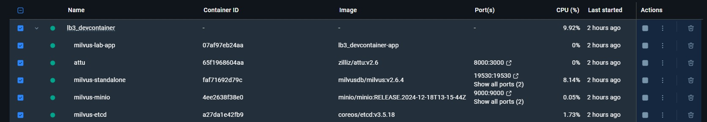
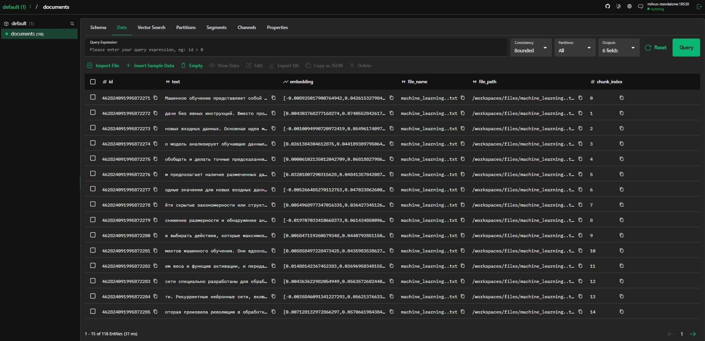
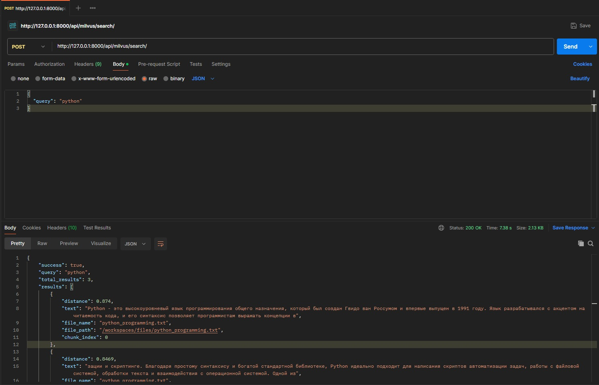

# Лабораторная работа №3 Векторные базы данных и семантический поиск

## План
1. Настройка окружения;
2. Создание модуля для работы с милвусом;
3. Парсинг текстовых файлов;
4. Задания.

## 1. Настройка окружения

- После выполнения требовани й указанных в методическом метериале я смог запустить контейнер результат представлен ниже



## 2-3. Создание векторной базы данных и Парсинг текстовых файлов

- Для семантического поиска по текстовым данным была создана векторная база данных на основе Milvus, включающая коллекцию с полями для хранения текстовых фрагментов, их векторных представлений, а также метаданных (название и путь к исходному файлу, индекс чанка). Векторные представления текстов генерируются с использованием мультиязычной модели эмбеддингов multilingual-e5-base, которая преобразует текстовые данные в числовые векторы размерностью 768, что позволяет эффективно сравнивать семантическую близость между документами и поисковыми запросами. Пример запуска представлен ниже

```
============================================================
1. Подключение к Milvus
============================================================
Подключение к Milvus установлено (standalone:19530)

============================================================
2. Инициализация эмбеддера (multilingual-e5-base)
============================================================
Загрузка модели intfloat/multilingual-e5-base...
Устройство: cpu
model.safetensors:   4%|█████▌                                                                                                 model.safetensors:   4%|
config.json: 100%|█████████████████████████████████████████████████████████████████████████████████████████████| 200/200 [00:00<00:00, 1.46MB/s]
Модель загружена. Размерность embeddings: 768

============================================================
3. Создание обработчика документов
============================================================

============================================================
4. Создание коллекции в Milvus
============================================================
Коллекция 'documents' удалена
Коллекция 'documents' создана (dim=768, metric=COSINE)

============================================================
5. Обработка файлов из директории /files
============================================================
Найдено файлов: 4

Обработка: machine_learning..txt
Парсинг файла: /workspaces/files/machine_learning..txt
Извлечено 30 чанков
Генерация embeddings...
Batches: 100%|████████████████████████████████████████████████████████████████████████████████████████████████████| 1/1 [00:01<00:00,  1.18s/it]
Загрузка в коллекцию 'documents'...
Вставлено 30 записей в коллекцию 'documents'
  Успешно: 30 чанков загружено

Обработка: python_programming.txt
Парсинг файла: /workspaces/files/python_programming.txt
Извлечено 26 чанков
Генерация embeddings...
Batches: 100%|████████████████████████████████████████████████████████████████████████████████████████████████████| 1/1 [00:00<00:00,  1.09it/s]
Загрузка в коллекцию 'documents'...
Вставлено 26 записей в коллекцию 'documents'
  Успешно: 26 чанков загружено

Обработка: vector_databases.txt
Парсинг файла: /workspaces/files/vector_databases.txt
Извлечено 32 чанков
Генерация embeddings...
Batches: 100%|████████████████████████████████████████████████████████████████████████████████████████████████████| 1/1 [00:01<00:00,  1.08s/it]
Загрузка в коллекцию 'documents'...
Вставлено 32 записей в коллекцию 'documents'
  Успешно: 32 чанков загружено

Обработка: web_development.txt
Парсинг файла: /workspaces/files/web_development.txt
Извлечено 30 чанков
Генерация embeddings...
Batches: 100%|████████████████████████████████████████████████████████████████████████████████████████████████████| 1/1 [00:01<00:00,  1.28s/it]
Загрузка в коллекцию 'documents'...
Вставлено 30 записей в коллекцию 'documents'
  Успешно: 30 чанков загружено

============================================================
6. Семантический поиск
============================================================
Загрузка модели intfloat/multilingual-e5-base...
Устройство: cpu
Модель загружена. Размерность embeddings: 768
Запрос: 'Что такое машинное обучение?'

Найдено результатов: 3

1. (Distance: 0.8919)
   Файл: machine_learning..txt
   Чанк #0
   Текст: Машинное обучение представляет собой подраздел искусственного интеллекта, который фокусируется на разработке алгоритмов и статистических моделей, позв...

2. (Distance: 0.8661)
   Файл: machine_learning..txt
   Чанк #4
   Текст: обобщать и делать точные предсказания на новых данных. Существует три основных типа машинного обучения: обучение с учителем, обучение без учителя и об...

3. (Distance: 0.8645)
   Файл: machine_learning..txt
   Чанк #2
   Текст: новых входных данных. Основная идея машинного обучения заключается в том, что алгоритмы могут улучшать свою производительность с опытом. Это достигает...

============================================================
8. Получение всех чанков исходного документа
============================================================
Файл: machine_learning..txt
Найдено чанков в документе: 30

Первые 3 чанка из документа:

  Чанк 1 (индекс 0):
  Машинное обучение представляет собой подраздел искусственного интеллекта, который фокусируется на ра...

  Чанк 2 (индекс 1):
  дачи без явных инструкций. Вместо программирования конкретных правил, системы машинного обучения обу...

  Чанк 3 (индекс 2):
  новых входных данных. Основная идея машинного обучения заключается в том, что алгоритмы могут улучша...

============================================================
7. Информация о коллекции
============================================================
Записей в коллекции: 118

============================================================
Готово!
============================================================ 
```


- После запуска всех компонентов я открыл веб-интерфейс Attu для Milvus по адресу localhost:8000. В интерфейсе нашёл ранее созданную коллекцию "documents"





## 4. Задание1

- Далее нужно было модифицировать конфиг для  использования cuda-зависимостей результат выполнения представлен ниже 

```
version: '3.8'

services:
  app:
    build:
      context: ..
      dockerfile: .devcontainer/Dockerfile
    container_name: milvus-lab-app
    working_dir: /workspaces
    volumes:
      - ../:/workspaces
    command: sleep infinity
    gpus: all        
    depends_on:
      - standalone
    networks:
      - internal-network
```

1.  Запуск сценария с помощью cuda

```
============================================================
1. Подключение к Milvus
============================================================
Подключение к Milvus установлено (standalone:19530)

============================================================
2. Инициализация эмбеддера (multilingual-e5-base)
============================================================
Загрузка модели intfloat/multilingual-e5-base...
Устройство: cuda
model.safetensors: 100%|████████████████████████████████████████████████████████████████████████████████████████████████████████████████████████████████████████████████████████| 1.11G/1.11G [10:46<00:00, 1.72MB/s]
tokenizer_config.json: 100%|████████████████████████████████████████████████████████████████████████████████████████████████████████████████████████████████████████████████████████| 418/418 [00:00<00:00, 2.43MB/s]
sentencepiece.bpe.model: 100%|███████████████████████████████████████████████████████████████████████████████████████████████████████████████████████████████████████████████████| 5.07M/5.07M [00:12<00:00, 390kB/s]
tokenizer.json: 100%|████████████████████████████████████████████████████████████████████████████████████████████████████████████████████████████████████████████████████████████| 17.1M/17.1M [00:20<00:00, 825kB/s]
special_tokens_map.json: 100%|██████████████████████████████████████████████████████████████████████████████████████████████████████████████████████████████████████████████████████| 280/280 [00:00<00:00, 1.51MB/s]
config.json: 100%|██████████████████████████████████████████████████████████████████████████████████████████████████████████████████████████████████████████████████████████████████| 200/200 [00:00<00:00, 4.18kB/s]
Модель загружена. Размерность embeddings: 768
```

## 5. Задание 2

- Была разработана и реализована полнофункциональная система API для семантического поиска по документам с использованием векторной базы данных Milvus и фреймворка Django Rest Framework.

```
django-admin startproject lab3Api
```

- Обработка запроса реализуется через конвейер семантического поиска: после получения текстового запроса пользователя, он преобразуется в числовой вектор с помощью модели multilingual-e5-base; затем система выполняет поиск наиболее близких векторов в базе данных Milvus и возвращает пользователю результаты.


- Пример views.py представлен ниже

```python
from rest_framework.views import APIView
from rest_framework.response import Response
from rest_framework import status
from .embedder import Embedder
from .milvus_client import MilvusClient
import json

class MilvusSearchAPIView(APIView):
    def post(self, request, *args, **kwargs):
        
        query = ""
        
        
        if hasattr(request, 'data') and request.data and isinstance(request.data, dict):
            query = request.data.get("query", "")
        
        # Из request.body
        if not query and hasattr(request, 'body') and request.body:
            try:
                data = json.loads(request.body.decode('utf-8'))
                query = data.get("query", "")
            except:
                pass
        
        if not query:
            return Response(
                {"error": "Запрос не может быть пустым"}, 
                status=status.HTTP_400_BAD_REQUEST
            )
        
        try:
           
            embedder = Embedder(model_name="intfloat/multilingual-e5-base")
            query_embedding = embedder.encode_query(query)
            
        except Exception as e:
            return Response(
                {"error": f"Ошибка генерации эмбеддинга: {str(e)}"}, 
                status=status.HTTP_500_INTERNAL_SERVER_ERROR
            )
        
        try:
            # Подключение к Milvus
            milvus = MilvusClient(host="localhost", port=19530)
            
        except Exception as e:
            return Response(
                {"error": f"Ошибка подключения к Milvus: {str(e)}"}, 
                status=status.HTTP_500_INTERNAL_SERVER_ERROR
            )
        
        collection_name = "documents"
        try:
            
            search_results = milvus.search(
                collection_name=collection_name,
                query_vectors=[query_embedding],
                top_k=3
            )
            
            
            formatted_results = []
            
            if search_results and len(search_results) > 0:
                for hit in search_results[0]:
                    formatted_results.append({
                        "distance": round(hit.get("distance", 0), 4), 
                        "text": hit.get("text", "Нет текста"), 
                        "file_name": hit.get("file_name", "N/A"), 
                        "file_path": hit.get("file_path", ""),
                        "chunk_index": hit.get("chunk_index", -1)  
                    })
            
            return Response({
                "success": True,
                "query": query,
                "total_results": len(formatted_results),
                "results": formatted_results
            }, status=status.HTTP_200_OK)
            
        except Exception as e:
            return Response(
                {"error": f"Ошибка при выполнении поиска: {str(e)}"}, 
                status=status.HTTP_500_INTERNAL_SERVER_ERROR
            )
```

- Пример машрутов в urls.py

```python
from django.urls import path
from .views import MilvusSearchAPIView

urlpatterns = [
    path('milvus/search/', MilvusSearchAPIView.as_view(), name='milvus-search'),
]
```

- На изображении ниже представлен интерфейс программы Postman после успешного выполнения POST-запроса к эндпоинту семантического поиска: http://127.0.0.1:8000/api/milvus/search/



## Заключение
В ходе лабораторной работы была создана и проверена система семантического поиска. Мы настроили рабочее окружение с поддержкой GPU, написали модуль для работы с векторной базой данных Milvus, сделали скрипт для обработки текстовых файлов и разработали API на Django REST Framework. Тестирование показало, что система работает правильно: она принимает текстовый запрос, переводит его в вектор с помощью модели на GPU, находит похожие документы в Milvus и возвращает результаты.

