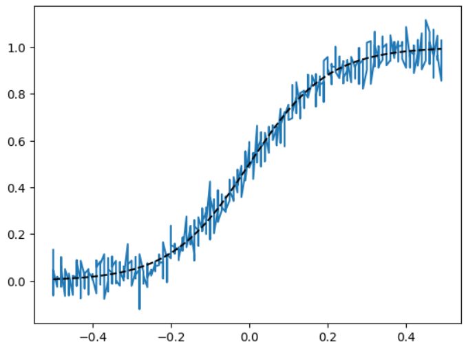
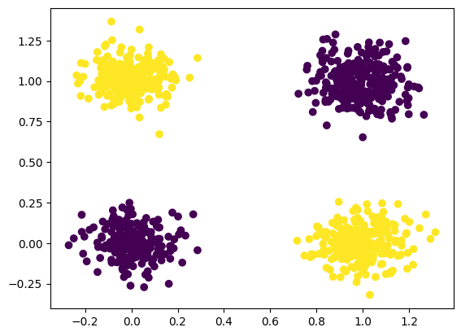
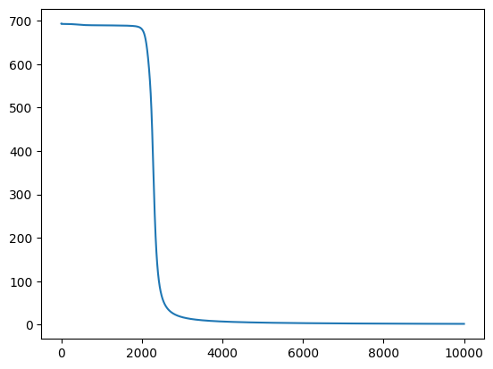

# Отчёт. Лабораторная работа №1. Введение в глубокое обучение

## Задание

Цель работы — познакомиться с фреймворком PyTorch и выполнить несколько заданий:

- Регрессия с использованием теоремы универсальной аппроксимации и ручного дифференцирования.
- Бинарная классификация с автодифференцированием в PyTorch.
- Обучение полносвязной нейронной сети для классификации изображений из набора данных CIFAR-100.

## Задание №1. Регрессия с использованием теоремы универсальной аппроксимации и ручного дифференцирования

Теорема универсальной аппроксимации утверждает, что нейронная сеть с одним скрытым слоем и достаточным количеством нейронов способна аппроксимировать любую непрерывную функцию с заданной точностью.

Задача в этом упражнении заключалась в обучении нейронной сети для предсказания непрерывных значений, то есть решения задачи регрессии. Для обучения использовался градиентный спуск, который требует вычислений производных.

Ручное дифференцирование включает вычисление производных функции потерь по весам сети. В этом случае применялось правило цепочки для многослойных сетей.

После подготовки данных и настройки нейронной сети, вычисления проводились с использованием библиотеки PyTorch, а для отображения результатов использовалась библиотека matplotlib.

### Результат обучения:

На первом графике изображен процесс подготовки данных, а на втором — как ошибка модели снижается в ходе обучения нейронной сети, позволяя ей успешно аппроксимировать сигмоидальную функцию и устранять шум.



Каждые 10,000 эпох веса нейронной сети обновляются, и модель становится всё более точной. На графике это видно - по мере обучения линия предсказаний приближается к истинной сигмоидальной функции. С каждым обновлением ошибка уменьшается, и модель всё точнее аппроксимирует сигмоид.


## Задание №2. Бинарная классификация с использованием автодифференцирования в PyTorch

В этом разделе мы решали задачу бинарной классификации, в которой модель должна была определить один из двух классов (например, 0 или 1).

После подготовки данных, основанных на искусственной выборке с двумя классами, была обучена нейронная сеть с использованием автодифференцирования, применяя метод градиентного спуска и подходящую для бинарной классификации функцию потерь.

Для улучшения результатов была выбрана новая функция активации, которая оказалась более эффективной в данной задаче.

### Результат обучения:

Когда функция потерь начала существенно уменьшаться, мы оценили результаты. Модель научилась различать два класса — жёлтые и фиолетовые точки, что подтвердило успешность её обучения.



На графике показан процесс изменения функции потерь. В ходе обучения модели на протяжении 10,000 итераций. Ось X отображает количество итераций (шагов обучения), от 0 до 10,000. Ось Y показывает значение функции потерь, которая измеряет различие между истинными метками и предсказаниями модели. В начале обучения функция потерь резко снижается, что говорит о значительном улучшении модели, после чего график плавно выравнивается и продолжает снижаться, что свидетельствует о постепенном улучшении предсказаний модели. Это типичная картина для обучения нейронной сети, где на первых этапах модель быстро достигает улучшений, а на более поздних шагах коррекции становятся менее заметными.




## Задание №3. Классификация изображений CIFAR-100

Задача классификации изображений из набора CIFAR-100 заключается в том, чтобы модель определила, к какому из 100 классов относится данное изображение.

Датасет CIFAR-100 включает 60 000 цветных изображений размером 32×32 пикселя, которые равномерно распределены между 100 классами. Для классификации мы выбрали три класса: изображения с яблоками (класс 0), лесами (класс 33) и львами (класс 43).

После подготовки и загрузки данных была построена модель многослойного перцептрона (MLP) с одним скрытым слоем. В процессе обучения использовался оптимизатор градиентного спуска, а для вычисления ошибки применялась кросс-энтропийная функция потерь.

### Результаты обучения:


Модель обучается решать задачу классификации изображений из набора данных CIFAR-100. Мы обучаем её различать два выбранных класса: класс 22 и класс 11.

    ...
    [238,     8] loss: 0.075
    [238,     2] val loss: 0.745
    [239,     8] loss: 0.074
    [239,     2] val loss: 0.690
    [240,     8] loss: 0.074
    [240,     2] val loss: 0.714
    [241,     8] loss: 0.073
    [241,     2] val loss: 0.778
    [242,     8] loss: 0.074
    [242,     2] val loss: 0.698
    [243,     8] loss: 0.073
    [243,     2] val loss: 0.710
    [244,     8] loss: 0.072
    [244,     2] val loss: 0.717
    [245,     8] loss: 0.072
    [245,     2] val loss: 0.681
    [246,     8] loss: 0.072
    [246,     2] val loss: 0.742
    [247,     8] loss: 0.072
    [247,     2] val loss: 0.742
    [248,     8] loss: 0.070
    [248,     2] val loss: 0.725
    [249,     8] loss: 0.070
    [249,     2] val loss: 0.769
    [250,     8] loss: 0.069
    [250,     2] val loss: 0.723
    ```


Этот фрагмент вывода представляет собой укороченный лог обучения модели на протяжении 250 эпох. Для каждой эпохи выводится информация о потере (loss) на обучающем наборе данных (loss) и валидационном наборе данных (val loss).

Затем была проведена проверка качества модели, которая показала высокую точность на тестовой выборке.

```
train
              precision    recall  f1-score   support

          22     0.9842    0.9960    0.9901       500
          11     0.9960    0.9840    0.9899       500

    accuracy                         0.9900      1000
   macro avg     0.9901    0.9900    0.9900      1000
weighted avg     0.9901    0.9900    0.9900      1000

--------------------------------------------------
test
              precision    recall  f1-score   support

          22     0.7227    0.8600    0.7854       100
          11     0.8272    0.6700    0.7403       100

    accuracy                         0.7650       200
   macro avg     0.7749    0.7650    0.7629       200
weighted avg     0.7749    0.7650    0.7629       200

--------------------------------------------------
```

**Ссылка на выполненyeю работу в Google Colab:** [Google Colab](https://colab.research.google.com/drive/1ES-cw-nAARI28nsID7XyejsVaYILk1rf?usp=sharing)

В ходе лабораторной работы была продемонстрирована реализация техник глубокого обучения с использованием PyTorch для задач регрессии, бинарной классификации и классификации изображений. Модель обучалась с применением градиентного спуска и функций потерь, подходящих для каждой задачи. В процессе обучения модель улучшала свои предсказания, что подтверждалось снижением функции потерь и улучшением точности. Важным этапом было использование автодифференцирования для оптимизации параметров. Также внимание уделялось предотвращению переобучения и улучшению архитектуры. Результаты на тестовых данных показали, что модель эффективно решает задачи классификации и регрессии, что подтверждает потенциал PyTorch для решения различных задач машинного обучения.
