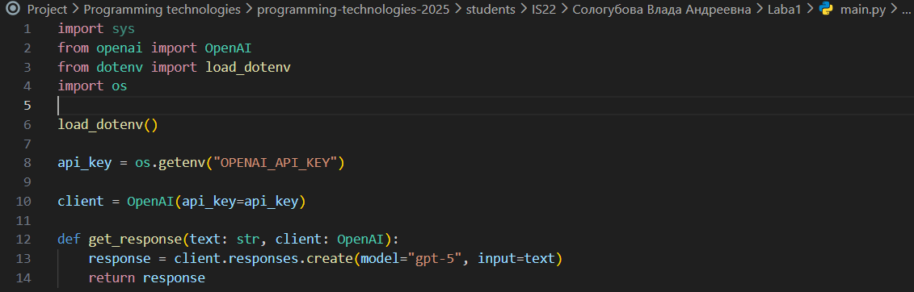
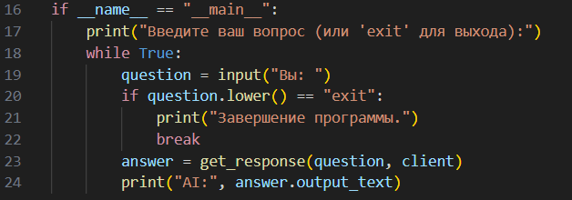
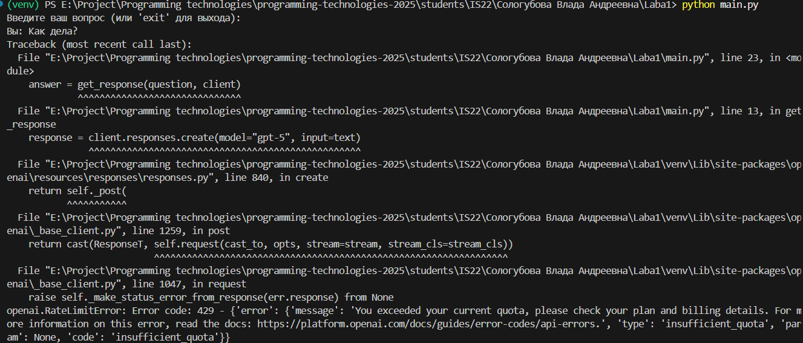
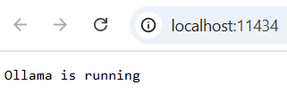
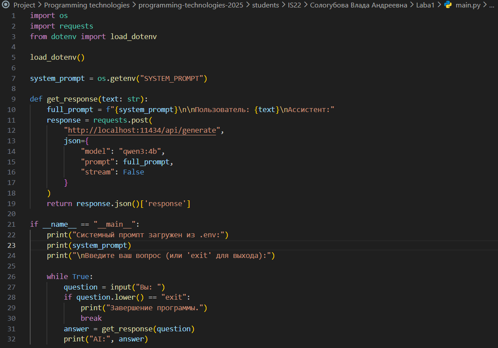
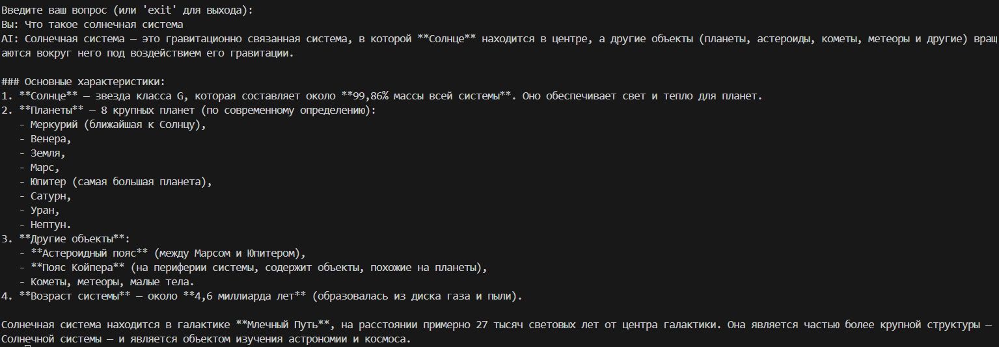
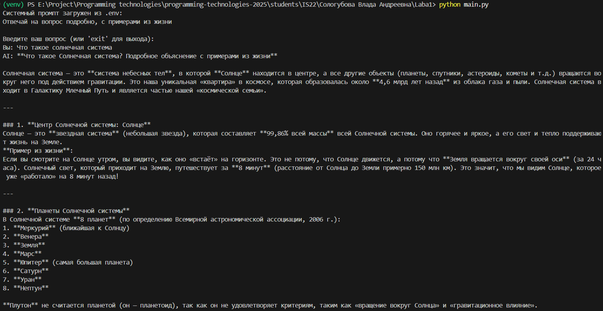
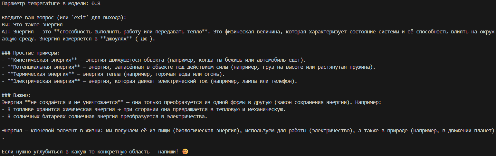
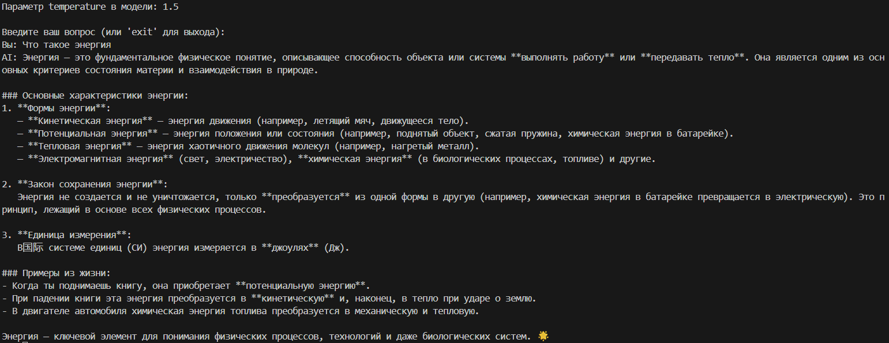
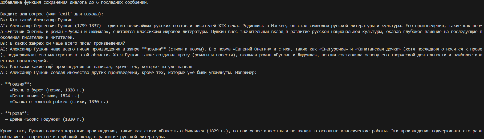

# Лабораторная работа №1. Тема: Знакомство с OpenAI API. Написание простого текстового ассистента

<ins>Цель</ins>: научиться работать с OpenAI API, чтобы создать простого текстового ассистента, который может отвечать на ваши вопросы.

## План

1. Настройка окружения;
2. Обращение к OpenAI Responses API;
3. Главный цикл;
4. Troubleshooting;
5. Задания.

---

## _1. Настройка окружения_

В начале создаём виртуальное окружение и активируем его. Далее по инструкции были установлены компонента OpenAI и создан файл requirements.txt, в который был скопирован список необходимых библиотек. Также был создан файл .env, в который был добавлен API-ключ. После этого файл .env был добавлен в .gitignore, чтобы не загружать ключ в репозиторий.

## _2. Обращение к API ответов OpenAI_

В данном пункте нужно было создать файл main.py с такой структурой (рис. 1). Этот файл настраивает подключение к OpenAI и позволяет взаимодействовать с моделью искусственного интеллекта.



_Рисунок 1: Файл main.py_

## _3. Главный цикл_

В данном пункте добавляем в файл main.py интерактивное общение, которое будет позволять задавать вопросы AI-модели через командную строку. (рис. 2)



_Рисунок 2: Интерактивное общение в файле main.py_

## _4. Устранение неполадок_

В данном шаге описаны все возможные ошибки, с которыми можно столкнуться при работе с API OpenAI, а также приведены рекомендации по их устранению. При работе с API OpenAI с данными ошибками столкновения не было, но при попытке сделать запрос в модели, выдавалась ошибка (рис. 3).



_Рисунок 3: Ошибка при попытке обращения в модель_

Эта ошибка говорит о том, что на данный момент отсутствует бесплатный доступ к этой модели. В результате использование модели стало невозможным без платной подписки.

Так как нет возможности использовать бесплатную версию Open AI таким способом, было решено использовать Ollama — локальный сервер моделей, совместимый с API OpenAI. После установки Ollama можно увидеть, что запустился локальный сервер, который поддерживает API, совместимый с OpenAI (рис. 4).



_Рисунок 4: Запущенный локальный сервер_

## _5. Задание_

1. В первом задании нужно было реализовать использование системного промпта через переменное окружение .env, либо через ручной ввод/выбор подсказки, и его сохранение в местах данных при выборе соответствующих опций в терминале. Было решено реализовать данное задание через переменное окружение .env, поэтому в файл .env была добавлена переменная SYSTEM_PROMPT. При запуске программы переменная автоматически загружается с помощью библиотеки python-dotenv. Ниже представлен код для работы с моделью Ollama с использованием системеного промпта (рис. 5):



_Рисунок 5: Файл main.py для работы с моделью Ollama_

Далее показаны примеры запуска программы без системного промта и с системным промптом (рис. 6, 7):



_Рисунок 6: Работа с моделью без системного промпта_



_Рисунок 7: Работа с моделью с системным промптом_

2. Во втором задании нужно было поиграться с параметром temperature в представлении языковой модели, понаблюдать за поведением языковой модели и результат отразить в отчёте. В файл main.py была добавлена возможность изменять параметр temperature. Далее был проведён эксперемент и выставлены три варианта параметра temperature: 0.1, 0.8 и 1.5 (рис. 8, 9, 10).


_Рисунок 8: Модель с temperature = 0.1_

При temperature = 0.1 ответ модели точный, структурированный. Модель строго следует фактам, совсем нет эмоциональной состовляющей.



_Рисунок 9: Модель с temperature = 0.8_

В ответе модели появляются более простые формулировки. Она также добавляет в ответ смайлики и дополнительные предложения о дальнейшей работе в дружелюбном ключе. Информация остаётся точной, но формат подачи меняетя на менее сухой и вовлекающий.



_Рисунок 10: Модель с temperature = 1.5_

Не смотря на высокую температуру, ответ модели остаётся логичным и структурированным. Но также появляются некорректные символы и смайлик. Присутствует эмоциональный окрас и дополнительные примеры.

В результате экспериментов с параметром temperature можно сделать вывод, что он существенно влияет на стиль и характер генерации текста, но не изменяет базовые знания модели. При низком temperature = 0.1 модель отвечает строго, формально. При temperature = 0.8 ответы остаются корректными, но приобретают более свободный стиль. При temperature = 1.5 усиливается креативность и появляются некорректные символы. Видно, что даже при сильно высоких значениях, модель генерирует ответы более-менее корректно.

3. В третьем задании нужно было реализовать ведение истории диалога, чтобы ИИ помнил, о чем пользователь с ним разговаривал. Ниже представлен код, с добавлением данного функционала:

```python
import os
import requests
from dotenv import load_dotenv

load_dotenv()

system_prompt = os.getenv("SYSTEM_PROMPT")
temp = 0.5
history = []

def creat_prompt(system_prompt, history, user_input):
prompt = system_prompt + "\n\nИстория диалога:\n"

    for m in history:
        if m["role"] == "user":
            prompt += f"Пользователь: {m['content']}\n"
        else:
            prompt += f"Ассистент: {m['content']}\n"

    prompt += f"\nПользователь: {user_input}\nАссистент:"

    return prompt

def get_response(text: str):

    full_prompt = creat_prompt(system_prompt, history, text)

    response = requests.post(
        "http://localhost:11434/api/generate",
        json={
            "model": "qwen3:4b",
            "prompt": full_prompt,
            "temperature": temp,
            "stream": False
        }
    )

    return response.json()['response']

if **name** == "**main**":

    print("Системный промпт загружен из .env:")
    print(system_prompt)
    print(f"\nПараметр temperature в модели: {temp}")
    print("\nДобавлена функция сохранения диалога до 6 последних сообщений.")
    print("\nВведите ваш вопрос (или 'exit' для выхода):")

    while True:
        question = input("Вы: ")
        if question.lower() == "exit":
            print("Завершение программы.")
            break

        answer = get_response(question)
        print("AI:", answer)
        history.append({"role": "user", "content": question})
        history.append({"role": "assistant", "content": answer})
        history = history[-6:]
```

Ниже представлен диалог, где модель помнит, о чём была речь в предыдуших сообщениях (рис. 11):



_Рисунок 11: Диалог с моделью, которая помнит историю диалога_

Вывод: В ходе выполнения лабораторной работы был успешно создан простой текстовый ассистент на основе Ollama,
реализованный по аналогии с OpenAI API. Были выполнены все задания, а именно: реализована загрузка системного промпта из переменной
окружения .env, добавлена возможность изменения параметра temperature, чтобы осуществлять наблюдения за поведением модели при разных значениях, а также реализована функция сохранения истории диалога. При проведении эксперементов, было выявлено, что модель при изменении параметра temperature меняет стиль ответа и его креативность, но при высоких значениях модель остатся способной ответить корректно, хоть и с небольшими недочётами. Таким образом, лабораторная работа позволила получить навыки работы с API языковых моделей с использованием локального сервера Ollama, с добавлением возможности добавления промпта, изменения параметра temperature и сохранения истории диалога.
