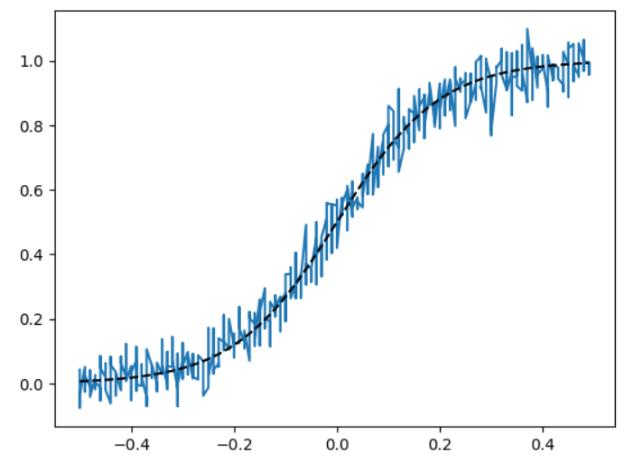
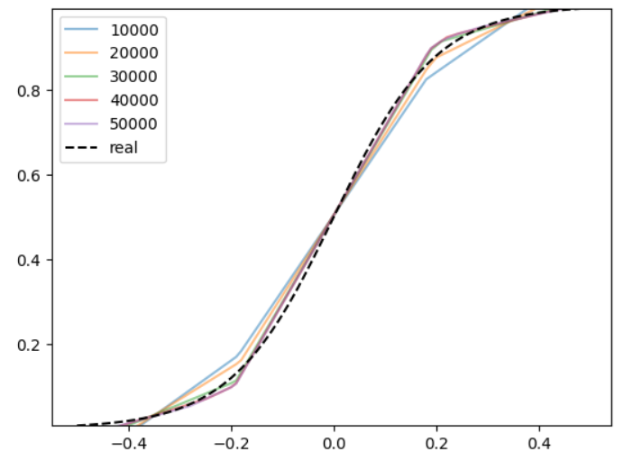
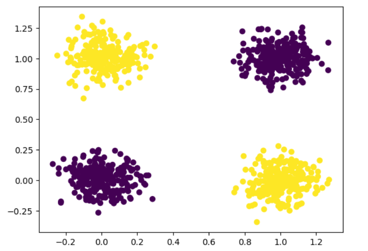
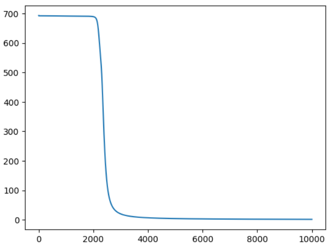
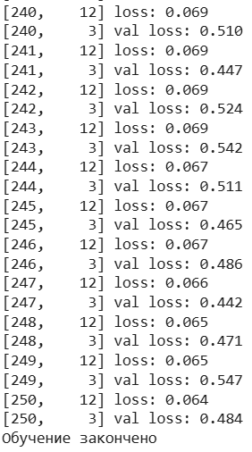
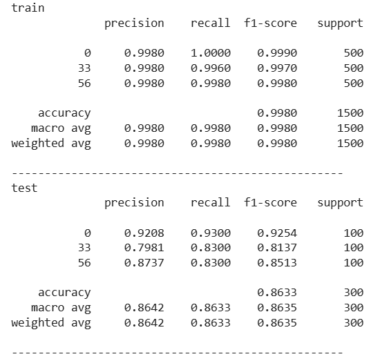
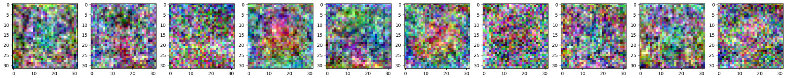

# Лабораторная работа №1 (Беляева И.С.). Тема: Введение в DL

## Задание

Необходимо познакомиться с фреймворком машинного обучения PyTorch и выполнить три задания:

1. Регрессия по теореме универсальной аппроксимации, ручное дифференцирование
2. Бинарная классификация с помощью автодиффиренцирования PyTorch
3. Обучить полносвязную нейронную сеть классификации 3 классов изображений из набора данных CIFAR100 по варианту из примера и затем повысить точность на тестовой выборке. Для задания 3 нужно сформировать свою подвыборку CIFAR100 по варианту.

Лабораторная выполнялась на платформе Google Colab.

---

## _1. Задача регрессии по теореме универсальной аппроксимации, ручное дифференцирование_

В первом задании нужно было реализовать задачу регрессии с использованием нейронной сети с одним скрытым слоем и активационной функцией ReLU. Нужно показать по теореме универсальной аппроксимации, что простая сеть способна приближать произвольные непрерывные функции. Так как в задаче нужно реализовать ручное дифференцирование, значит обучение сети должно выполняться вручную, без использования встроенных средств автоматического дифференцирования.

Для решения задания в начале реализуем генерацию выборки. Для этого создаём массив входных данных в диапазоне от −0.5 до 0.5, при этом каждое значение повторяется пять раз. Далее вычисляем сигмоидальную функцию для каждого значения массива X. После этого формируем случайный шум с помощью добавления к каждому истинному значению функции случайный гауссовский шум с нулевым средним.

```python
X = (np.arange(100)/100 - 0.5).repeat(5)
y = 1/(1+np.exp(-10*X))
yn = np.random.normal(scale=0.05, size=y.size)+y
```

После этого формируем график, на котором видно шумные обучающие данные и истинную целевую функцию (рис. 1).



_Рисунок 1: График зашумлённых данных и истинных значений сигмоидальной функции_

Далее создаём простую нейронную сеть с одним скрытым слоем. Для этого переводим массивы X и yn в формат PyTorch, чтобы данные имели корректную форму в виде количества объектов и размерности признаков. Данные такого вида мы сможем использовать в матричных операциях сети. После этого задаём размер скрытого слоя 64, определяя количество нейронов. Далее создаём случайные веса для скрытого и выходного слоя, а также создаём нулевые смещения, которые позволяют нейронам корректно реагировать на входные данные и обучаться во время градиентного спуска.

```python
tensor_X = torch.Tensor(X.reshape(-1, 1))
tensor_y = torch.Tensor(yn.reshape(-1, 1))
HIDDEN_SIZE = 64
weights_1 = (torch.rand(1, HIDDEN_SIZE)-.5)/10
bias_1 = torch.zeros(HIDDEN_SIZE)
weights_2 = (torch.rand(HIDDEN_SIZE, 1)-.5)/10
bias_2 = torch.zeros(1)
```

Теперь перейдём к обучению нейронной сети задачи регрессии. Создаём активационную функцию ReLU, которая на выходе заменяет все отрицательные значения на 0, а положительные оставляет без изменений. Далее реализуем прямой проход нейросети: входное значение сначала умножается на веса первого слоя и к нему добавляется смещение скрытого слоя, затем результат проходит через ранее созданную функцию активации ReLU, после чего выход скрытого слоя взвешивается весами второго слоя, суммируется и к нему добавляется смещение выходного нейрона, формируя итоговое предсказание сети. Создаём функцию loss, вычисляя сумму квадратов разностей между предсказанными значениями и истинными. Данная функция показывает насколько сильно сеть ошибается на каждой точке.

```python
relu = lambda x: torch.maximum(x, torch.Tensor([0]))
forward = lambda x: (weights_2.t()*relu((weights_1*x) + bias_1)
                      ).sum(axis=-1,keepdims=True) + bias_2
loss = lambda y, y_: ((y-y_)**2).sum(axis=-1)
```

Далее создаём функцию backward, которая вычисляет градиенты функции потерь по всем весам и смещениям сети, учитывая ReLU в скрытом слое, чтобы затем обновить параметры нейросети с помощью градиентного спуска. По сути реализует обратный проход по нейронной сети.

```python
def backward(X, y, y_pred):
    dL = 2*(y_pred-y)
    Ax = (weights_1*X) + bias_1
    A = relu(Ax)
    dW2 = torch.mm(A.t(), dL)
    db2 = dL.sum(axis=0)
    dA = torch.mm(dL, weights_2.t())
    dA[Ax<=0] = 0
    dW = torch.mm(X.t(), dA)
    db = dA.sum(axis=0)

    return dW, db, dW2, db2
```

После создаём функцию optimize, которая реализует сам градиентный спуск. Обновляются веса и смещения с учётом вычисленных градиентов, чтобы уменьшить ошибку сети.

```python
def optimize(params, grads, lr=0.001):
    W1, b1, W2, b2 = params
    W1 -= lr*grads[0]
    W2 -= lr*grads[2]
    b1 -= lr*grads[1]
    b2 -= lr*grads[3]

    return W1, b1, W2, b2
```

Теперь создаём основной цикл обучения нейросети на 50 тыс эпох. Для этого с помощью ранее созданных функций вычисляем текущее предсказание сети, текущую ошибку сети, градиенты функции потерь. И применяем градиентный спуск для списка весов и смещений.

```python
for i in range(50000):
  output = forward(tensor_X)
  cur_loss = loss(output, tensor_y)
  grads = backward(tensor_X, tensor_y, output)
  params = [weights_1, bias_1, weights_2, bias_2]
  weights_1, bias_1, weights_2, bias_2 = optimize(params, grads, 1e-4)
```

Чтобы наглядно увидеть как сеть ведёт себя на протяжении 50 тысяч итераций, строим график текущих предсказаний сети каждые 10 тысяч итераций. Благодаря выводу мы можем наблюдать как сеть постепенно приближается к истинной функции. Также для наглядности добавляем на график пунктирную линию истинной функции (рис. 2).



_Рисунок 2: График с истинной функцией и предсказаниями сети каждые 10 тысяч итераций_

На графике видно, что сеть с увеличением числа итераций всё точнее повторяет форму истинной функции, демонстрируя работу теоремы универсальной аппроксимации. Низкое значение финальной средней ошибки подтверждает успешность обучения и точность аппроксимации.

## _2. Бинарная классификация с помощью автодиффиренцирования PyTorch_

Во втором задании нужно было реализовать бинарную классификацию на PyTorch, используя автоматическое дифференцирование. Для реализации задания была взята задача XOR, в которой объекты описываются двумя признаками. Класс объекта равен 1, если значения признаков различаются, и равен 0, если значения совпадают. Данная задача не является линейно разделимой, поэтому для её решения будет использоваться нейронная сеть с одним скрытым слоем и нелинейной функцией активации.

В начале генерируем выборку и инициализируем параметры нейронной сети. Был создан рандомный массив X из 1000 объектов, каждый из которых описывается двумя признаками (только 0 или 1). Таким образом формируется набор из 1000 точек с двумя бинарными признаками.
Далее формируем по правилу XOR целевую переменную y. Для каждого объекта суммируются два признака, и берётся остаток от деления на 2. В результате метка класса будет 1, если признаки различаются, или 0 — если совпадают. Теперь добавляем к входным данным случайный гауссов шум с нулевым средним и стандартным отклонением 0.1, чтобы предотвратить совпадение точек.

```python
X = np.random.randint(2, size=(1000, 2))
y = (X[:, 0] + X[:, 1]) % 2
X = X + np.random.normal(0, scale=0.1, size=X.shape)
plt.scatter(X[:, 0], X[:, 1], c=y)
```

В конце выводим получившиеся данные, где каждая точка отображена на плоскости и выделенная цветом в зависимости от значения целевой переменной y (рис. 3).



_Рисунок 3: Распределение точек двух классов по правилу XOR_

Переходим к подготовке данных для обучения в PyTorch и инициализации параметров нейронной сети. Преобразуем массив входных данных X и целевые метки в формат PyTorch. Входные данные теперь представлены в виде произвольного числа объектов с двумя признаками, а целевая переменная y в виде столбца, что соответствует формату выходного слоя нейронной сети. Далее задаём размер скрытого слоя 16, который определяет количество нейронов. После вручную инициальзируем веса и смещение сети в скрытом и выходном слое. Веса инициализируются малыми случайными значениями, а смещения - нулями. Также для всех параметрво включаем вычисление градиентов, чтобы использовать механизм автоматического дифференцирования PyTorch при обучении модели.

```python
tensor_X = torch.Tensor(X.reshape(-1, 2))
tensor_y = torch.Tensor(y.reshape(-1, 1))

HIDDEN_SIZE = 16

weights_1 = ((torch.rand(2, HIDDEN_SIZE)-.5)/10).detach().requires_grad_(True)
bias_1 = torch.zeros(HIDDEN_SIZE, requires_grad=True)

weights_2 = ((torch.rand(HIDDEN_SIZE, 1)-.5)/10).detach().requires_grad_(True)
bias_2 = torch.zeros(1, requires_grad=True)
```

Переходим к обучению нейронной сети задачи классификации. Создаём активационную функцию сигмоиды, которая преобразует входные значения в диапазон от 0 до 1, что позволит интерпретировать выход сети как принадлежностиь к классу 1. Затем создаём функцию прямого прохода нейронной сети, котрая описывает работу многослойного персептрона с одним скрытым слоем. После добавляем функцию потерь для бинарной классификации, которая измеряет расхождение между истинными метками и предсказанными вероятностями.

```python
def sigmoid(x):
    return 1/(1+torch.exp(-x))

def forward(x):
    hidden = torch.mm(x, weights_1) + bias_1
    hidden_nonlin = sigmoid(hidden)
    output = (weights_2.t()*hidden_nonlin).sum(axis=-1,keepdims=True) + bias_2
    return sigmoid(output)

def loss(y_true, y_pred):
    return -1*(y_true*torch.log(y_pred)+(1-y_true)*torch.log(1-y_pred)).sum()

```

Теперь создаём цикл обучения, который выполняется 10000 итераций. В нём с помощью ранее описанных функций выполняется прямой проход нейронной сети для всей обучающей выборки, вычисляется значение функции потерь между истинными метками и предсказаниями модели. После этого запускается механизм автоматического дифференцирования PyTorch, который вычисляет градиенты функции потерь по всем параметрам сети. Внутренний цикл позволяет последовательно обновить все обучаемые параметры с помощью градиентного спуска, уменьшая их на величину градиента, умноженного на шаг обучения. В конце главного цикла сохраняется текущее значение функции потерь в список.

```python
for i in range(iters):
    output = forward(tensor_X)
    lossval = loss(tensor_y, output)
    lossval.backward()
    for w in params:
        with torch.no_grad():
            w -= w.grad*lr
        w.grad.zero_()
    losses.append(lossval.item())
plt.plot(losses)
```

После этого строится график изменения функции потерь в процессе обучения нейронной сети (рис. 4), чтобы наглядно показать процесс сходимости модели и снижение ошибки по мере обновления весов. Можно увидеть, что по мере увеличения числа итераций значение функции потерь уменьшается, что показывает, что нейронная сеть постепенно обучается и её предсказания становятся ближе к истинным меткам классов.



_Рисунок 4: График изменения функции потерь в процессе обучения нейронной сети_

Теперь перейдём к проверке результатов обучения. Для этого создаём переменные для хранения вычисления разницы между максимальным и минимальным значением признаков выборки, чтобы определить диапазон данных по осям. Далее создаём одномерный массив значений с шагом 0.01, который будем использовать для построения сетки точек на плоскости признаков. Также сохраняем в отдельной переменной количество точек в одном измерении сетки, чтобы потом правильно преобразовать данные в двумерный массив для визуализации. После создаём пустой список для хранения координат всех точек сетки.

```python
X_diff = X.max() - X.min()
X_left = X.min() - 0.1*X_diff
X_right = X.max() + 0.1*X_diff
grid = np.arange(X_left, X_right, 0.01)
grid_width = grid.size
surface = []
```

Далее двумя вложенными циклами создаём все возможные комбинации значений координат на сетке, формируя двумерное пространство. После преобразуем список точек в массив NumPy и реализуем прямой проход для всех точек сетки через нейронную сеть, предварительно отключив вычисление градиентов, чтобы не отображать обучение сети.

```python
for x1 in grid:
    for x2 in grid:
        surface.append((x1, x2))
surface = np.array(surface)

with torch.no_grad():
    Z = forward(torch.Tensor(surface)).detach().numpy()
```

Полученные массивы предсказаний Z и координат xx и yy преобразуются в двумерную форму, соответствующую сетке точек, чтобы их можно было использовать для построения контурного графика. Cтроим цветную карту вероятностей, которая наглядно показывает разделяющую поверхность между классами. Добавляем на график обучающую выборку, где по цвету точек можно понять к какому классу они относятся. Фиолетовые точки это класс 0, а жёлтые точки это класс 1.

```python
Z = Z.reshape(grid_width, grid_width)
xx = surface[:, 0].reshape(grid_width, grid_width)
yy = surface[:, 1].reshape(grid_width, grid_width)

plt.contourf(xx, yy, Z, alpha=0.5)

plt.scatter(X[:, 0], X[:, 1], c=output.detach().numpy()>0.5)

plt.xlim(X_left, X_right)
plt.ylim(X_left, X_right)
```

Получившийся график показывает, что модель успешно справляется с разделением точек по классам (рис. 5).


_Рисунок 5: Визуализация разделяющей поверхности нейронной сети для задачи бинарной классификации_

В итоге получилось реализовать бинарную классификацию с помощью автодиффиренцирования PyTorch и на примере задачи XOR показать, что нейронная сеть с одним скрытым слоем и нелинейной функцией активации способна корректно разделять классы, даже если данные не являются линейно разделимыми.

## _3. Классификация изображений CIFAR100_

Последним заданием стало обучение полносвязной нейронной сети для классификации изображений из набора данных CIFAR-100. Нужно было сформировать собственную подвыборку классов в соответствии с номером группы и вариантом, после чего обучить модель классификации и оценить её качество на обучающей и тестовой выборках.

Набор данных CIFAR-100 состоит из 60 000 цветных изображений, разделённых на 100 классов, в каждом из которых по 600 изображений. Набор данных разделён на 50 000 обучающих изображений и 10 000 тестовых изображений. Каждое изображение в наборе данных CIFAR-100 представляет собой цветное изображение размером 32x32.

В начале скачиваем архив с CIFAR-100 и распаковывается в рабочую директорию. Внутри находятся бинарные файлы train и test, отвечающие за обучающую и тестовую выборку. После загружаем обучающую и тестовую выборку в бинарный файл pickle. По заданию задаём список номеров классов CIFAR-100. Номера классов 1 и 2 выбраны по номеру группы (22) + 11 и варианту (19) + 37.

```python
with open('cifar-100-python/train', 'rb') as f:
    data_train = pickle.load(f, encoding='latin1')
with open('cifar-100-python/test', 'rb') as f:
    data_test = pickle.load(f, encoding='latin1')

CLASSES = [0, 33, 56]
```

Далее извлекаем из словаря изображение из обучающей выборки и преобразуем его в формат (N, 3, 32, 32), где N — количество изображений, 3 — число цветовых каналов, а 32 и 32 — размер изображения. После извлекаем метки классов из обучающей выборки и преобразуются в массив NumPy. С помощью логической маски отбираем только изображения и метки, которые соответствуют ранее прописанным классам, заданным в списке CLASSES. Перенумировываем метки классов в диапозон от 0 до 2 для корректной работы модели классификации. И удаляем исходный словарь обучающей выборки, так как он нам больше не понадобится. После такие же действия проводим и с тестовой выборкой.

```python
train_X = data_train['data'].reshape(-1, 3, 32, 32)
train_X = np.transpose(train_X, [0, 2, 3, 1])
train_y = np.array(data_train['fine_labels'])
mask = np.isin(train_y, CLASSES)
train_X = train_X[mask].copy()
train_y = train_y[mask].copy()
train_y = np.unique(train_y, return_inverse=1)[1]
del data_train

test_X = data_test['data'].reshape(-1, 3, 32, 32)
test_X = np.transpose(test_X, [0, 2, 3, 1])
test_y = np.array(data_test['fine_labels'])
mask = np.isin(test_y, CLASSES)
test_X = test_X[mask].copy()
test_y = test_y[mask].copy()
test_y = np.unique(test_y, return_inverse=1)[1]
del data_test
Image.fromarray(train_X[50]).resize((256,256))
```

В конце выводим пример изображения из сформированной обучающей подвыборки, увеличенный до размера 256 на 256 (рис. 6).


_Рисунок 6: Пример изображения из обучающей выборки_

Теперь создадим Pytorch DataLoader'a. Он отвечает за удобную и эффективную подачу данных в нейронную сеть во время обучения и тестирования. Задаём количество изображений, которые подаются в модель за одну итерацию обучения или тестирования. В цикле входные изображения и метки классов преобразуются в тензоры PyTorch, при этом метки кодируются в формате one-hot векторов, соответствующих числу выбранных классов. Затем данные объединяются в объекты TensorDataset, которые передаются в DataLoader. DataLoader автоматически разбивает данные на мини-батчи заданного размера и перемешивает их. Полученный загрузчик сохраняется в словарь dataloader под ключом 'train' или 'test'.

```python
batch_size = 128
dataloader = {}
for (X, y), part in zip([(train_X, train_y), (test_X, test_y)],
                        ['train', 'test']):
    tensor_x = torch.Tensor(X)
    tensor_y = F.one_hot(torch.Tensor(y).to(torch.int64),
                                     num_classes=len(CLASSES))/1.
    dataset = TensorDataset(tensor_x, tensor_y)
    dataloader[part] = DataLoader(dataset, batch_size=batch_size, shuffle=True)
dataloader
```

Теперь перейдём к созданию полносвязной нейронной сети для классификации изображений CIFAR-100. Сначала определяем вспомогательный слой Normalize в виде класса, который выполняет нормализацию изображений, то есть входных данных: значения пикселей приводятся к диапазону от 0 до 1, затем центрируются и масштабируются с использованием средних значений и стандартных отклонений по каналам. После нормализации изображения разворачиваются в векторы признаков.

```python
class Normalize(nn.Module):
    def __init__(self, mean, std):
        super(Normalize, self).__init__()
        self.mean = torch.tensor(mean)
        self.std = torch.tensor(std)

    def forward(self, input):
        x = input / 255.0
        x = x - self.mean
        x = x / self.std
        return torch.flatten(x, start_dim=1)

 def __init__(self, mean, std):
```

Далее созаём класс Cifar100_MLP, который представляет многослойный перцептрон с одним скрытым слоем и активационной функцией ReLU. Сеть принимает на вход изображения размером 32×32×3 и выдаёт предсказания для заданного числа классов. В конце создаётся экземпляр модели с выбранным размером скрытого слоя и количеством классов, соответствующим подвыборке по варианту.

```python
class Cifar100_MLP(nn.Module):
def **init**(self, hidden_size=32, classes=100):
super(Cifar100_MLP, self).**init**()
self.norm = Normalize([0.5074,0.4867,0.4411],[0.2011,0.1987,0.2025])
self.seq = nn.Sequential(
nn.Linear(32*32*3, hidden_size),
nn.ReLU(),
nn.Linear(hidden_size, classes),
)

    def forward(self, input):
        x = self.norm(input)
        return self.seq(x)

HIDDEN_SIZE = 10
model = Cifar100_MLP(hidden_size=HIDDEN_SIZE, classes=len(CLASSES))
model

```

Теперь задаём функцию потерь, которая позволяет оценить расхождения между истинными классами и предсказаниями модели. Также для обновления параметров сети применяется метод стохастического градиентного спуска (SGD) с заданным шагом обучения, который постепенно минимизирует значение функции потерь и улучшает качество классификации.

```python
criterion = nn.CrossEntropyLoss()
optimizer = optim.SGD(model.parameters(), lr=0.005)
```

Переходим к одному из самых главных шагов - обучение модели. Задаём 250 эпох обучения и вычисляем количество мини-батчей в обучающей и тестовой выборках, для дальнейшего использования в усреднении функции потерь. Создаётся цикл, где на каждой эпохе модель последовательно обрабатывает всю обучающую выборку, разбитую на мини-батчи, выполняя прямой проход, вычисление функции потерь и обратное распространение ошибки с последующим обновлением весов. После завершения обучения на текущей эпохе производится оценка модели на тестовой выборке без обновления параметров.

```python
EPOCHS = 250
steps_per_epoch = len(dataloader['train'])
steps_per_epoch_val = len(dataloader['test'])
for epoch in range(EPOCHS):
    running_loss = 0.0
    model.train()
    for i, batch in enumerate(dataloader['train'], 0):
        inputs, labels = batch

        optimizer.zero_grad()

        outputs = model(inputs)
        loss = criterion(outputs, labels)

        loss.backward()
        optimizer.step()

        running_loss += loss.item()
    print(f'[{epoch + 1}, {i + 1:5d}] loss: {running_loss / steps_per_epoch:.3f}')
    running_loss = 0.0
    model.eval()
    with torch.no_grad():
        for i, data in enumerate(dataloader['test'], 0):
            inputs, labels = data

            outputs = model(inputs)
            loss = criterion(outputs, labels)
            running_loss += loss.item()
    print(f'[{epoch + 1}, {i + 1:5d}] val loss: {running_loss / steps_per_epoch_val:.3f}')
print('Обучение закончено')
```

В ходе обучения выводим значения функции потерь на обучающей и тестовой выборках (рис. 7). Можно заметить, что в конце обучения на последних эпохах loss становится совсем низким, а val loss начинает колебаться.



_Рисунок 7: Изменения функции потерь за 10 последних эпох на обучающей и тестовой выборках в процессе обучения модели_

Теперь проверим качество модели по классам на обучающей и тестовой выборках (рис. 8). Сначало проанализируем качество модели на обучающей выборке. Полученные результаты показывают, что модель практически идеально классифицирует обучающую выборку, так как все показатели выше 0,995.

На тестовой выборке можно увидеть, что модель лучше всего распознаёт класс 0, а на классе 33 у модели встречается больше всего ошибок. Можно сделать вывод, что модель хорошо обобщает данные, но качество заметно падает по сравнению с обучением.



_Рисунок 8: Проверка качества модели по классам на обучающей и тестовой выборках_

Теперь сделаем визуализацию первого слоя нейронной сети, чтобы понять, какие визуальные признаки изучает модель при классификации изображений CIFAR-100. Переводим веса первого линейного слоя в формат изображения, нормализуем их значения и отображаем как цветные карты, чтобы наглядно увидеть, какие шаблоны наиболее важны для работы модели.

```python
weights = list(model.parameters())[0].detach().numpy()
print(weights.shape)
fig, ax = plt.subplots(1, weights.shape[0], figsize=(3*weights.shape[0], 3))
for i, ω in enumerate(weights):
    ω = ω.reshape(32, 32, 3)
    ω -= np.percentile(ω, 1, axis=[0, 1])
    ω /= np.percentile(ω, 99, axis=[0, 1])
    ω = np.clip(ω, 0, 1)
    ax[i].imshow(ω)
```

При выводе можно заметить, что первый слой нейронной сети изучает простые признаки, а не осмысленные объекты (рис. 9). Он формирует базовые визуальные представления, которые затем используются следующими слоями модели.



_Рисунок 9: Визуализация весов_

Вывод: В ходе выполнения лабораторной работы были изучены базовые принципы глубокого обучения и фреймворка PyTorch на практике. Были реализованы задачи такие как регрессия с ручным дифференцированием, бинарная классификация с использованием автоматического дифференцирования и классификация изображений CIFAR-100 с помощью полносвязной нейронной сети. В первом задании была продемонстрирована теорема универсальной аппроксимации и показано, что простая нейронная сеть способна приближать сложные нелинейные функции. Во втором задании подтверждена эффективность автодифференцирования PyTorch на примере задачи XOR и визуализирована разделяющая поверхность классов. В третьем задании была сформирована собственная подвыборка CIFAR-100 на основе собственного варианта, обучена модель классификации, проведена оценка качества на обучающей и тестовой выборках, а также выполнена визуализация весов первого слоя. Полученные результаты показали корректную работу реализованных моделей и позволили закрепить теоретические знания практическими навыками работы с нейронными сетями и PyTorch, что подтверждает достижение всех целей лабораторной работы.
