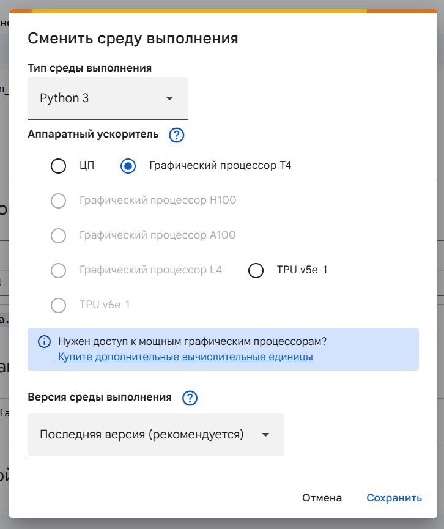
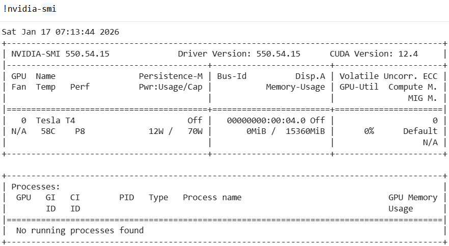
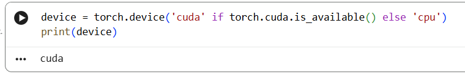
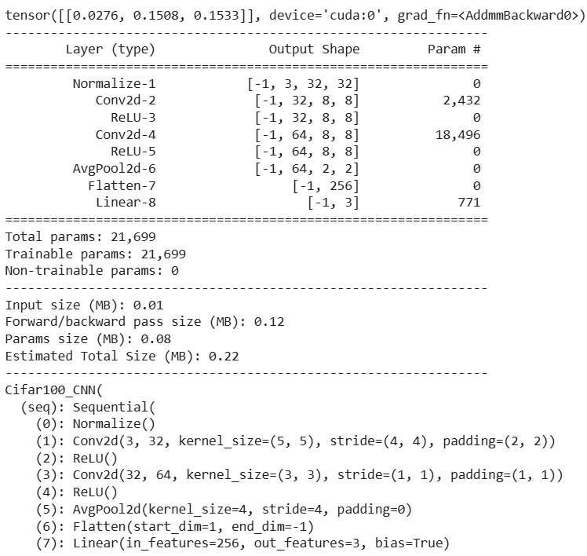
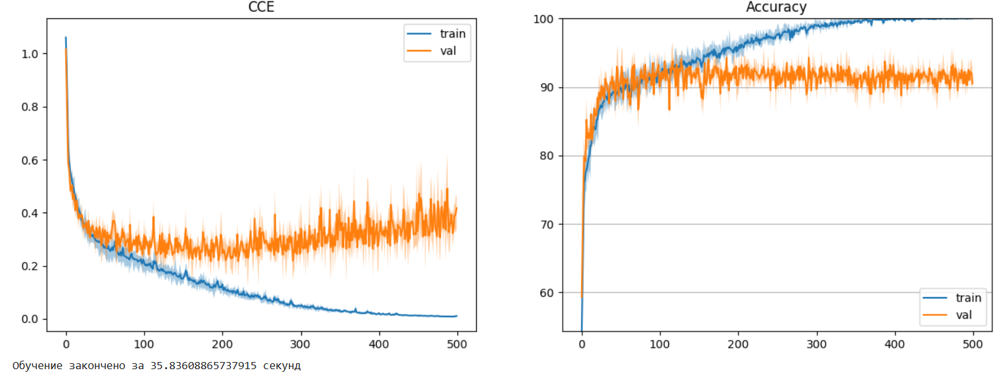
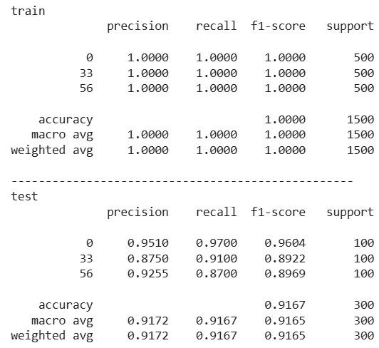
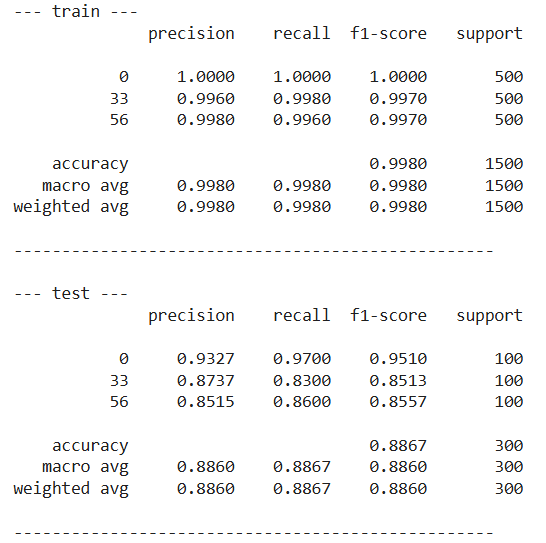
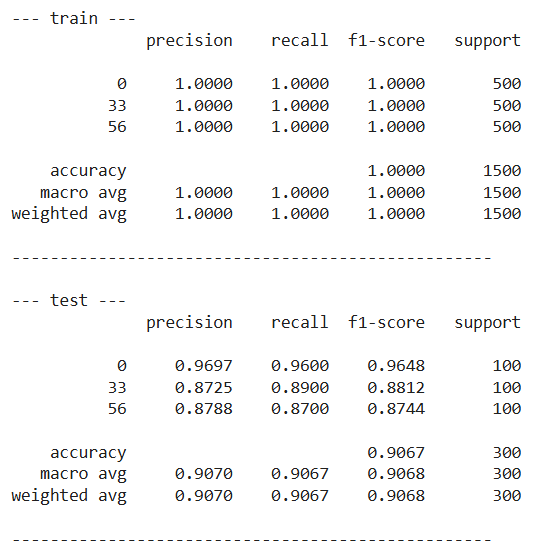
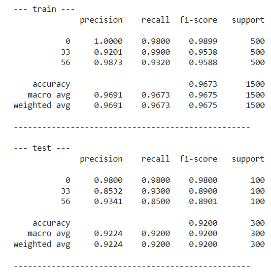
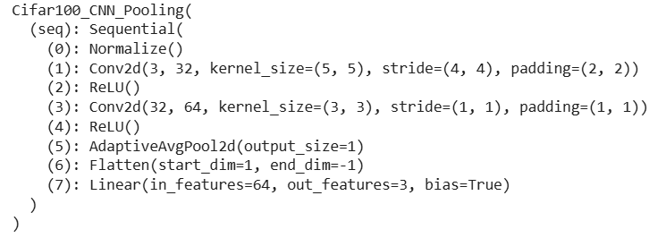

# Лабораторная работа №2 (Беляева И.С.). Тема: Сверточная нейросеть

## Задание

1. Выбрать свои классы и обучить сверточную нейронную сеть из примера, используя GPU
2. Повысить точность модели, проведя три обучения для 3 разных тактик пуллинга: пуллинг с помощью шага свёртки stride, макс пуллинг, усредняющий пуллинг.
3. Выбрать лучшую конфигурацию. Сохранить модель.

Лабораторная выполнялась на платформе Google Colab.

---

## _1. Классификация изображений CIFAR100_

В первой части лабораторной работы нужно выполнить подготовку данных, построение архитектуры модели для классификации изображений CIFAR100, её обучение на GPU, а также анализ качества классификации на обучающей и тестовой выборках.

В начале лабораторной работы были импортированы необходимые библиотеки для работы с массивами данных, построения и обучения нейронных сетей, визуализации результатов обучения, а также вспомогательные модули для загрузки данных, отображения изображений и вычисления метрик качества классификации.

После в настройках среды выполнения Google Colab в качестве аппаратного ускорителя был выбран графический процессор (рис. 1), так как использование GPU требуется условиями задания и необходимо для эффективного обучения сверточной нейронной сети.



_Рисунок 1: Настройка среды выполнения Google Colab_

Для проверки корректности подключения графического процессора была выполнена команда nvidia-smi, позволяющая отобразить информацию о доступном GPU и подтвердить его наличие в среде выполнения (рис. 2).



_Рисунок 2: Информация о доступном графическом процессоре_

Далее было определено вычислительное устройство, на котором будет выполняться обучение нейронной сети. Результат выполнения команды показал, что в качестве устройства выбран cuda (рис. 3), что подтверждает успешное использование графического процессора для дальнейших вычислений.



_Рисунок 3: Результат проверки доступности GPU_

Для работы с набором данных CIFAR-100 была произведён его загрузка и распаковка. Эти шаги необходимы для того, чтобы получить локальные копии изображений и меток классов, с которыми далее будет работать сверточная нейронная сеть.

После скачивания и распаковки CIFAR-100, загружаем обучающую и тестовую выборки из бинарных файлов с помощью pickle. По заданию задаём список номеров классов CIFAR-100 как и в прошлой лабораторной работе. Из исходных данных извлекаются изображения и метки, изображения приводятся к формату (N, 3, 32, 32), а метки перенумеровываются в диапазон от 0 до 2 для корректной работы модели. Логическая маска используется для фильтрации только выбранных классов. Аналогичные действия выполняются для тестовой выборки.

```python
with open('cifar-100-python/train', 'rb') as f:
    data_train = pickle.load(f, encoding='latin1')
with open('cifar-100-python/test', 'rb') as f:
    data_test = pickle.load(f, encoding='latin1')

CLASSES = [0, 33, 56]

train_X = data_train['data'].reshape(-1, 3, 32, 32)
train_X = np.transpose(train_X, [0, 2, 3, 1])
train_y = np.array(data_train['fine_labels'])
mask = np.isin(train_y, CLASSES)
train_X = train_X[mask].copy()
train_y = train_y[mask].copy()
train_y = np.unique(train_y, return_inverse=1)[1]
del data_train

test_X = data_test['data'].reshape(-1, 3, 32, 32)
test_X = np.transpose(test_X, [0, 2, 3, 1])
test_y = np.array(data_test['fine_labels'])
mask = np.isin(test_y, CLASSES)
test_X = test_X[mask].copy()
test_y = test_y[mask].copy()
test_y = np.unique(test_y, return_inverse=1)[1]
del data_test
Image.fromarray(train_X[50]).resize((256,256))
```

В конце выводится пример изображения из обучающей подвыборки как и в прошлой лабораторной работе (рис. 4).


_Рисунок 4: Пример изображения из обучающей выборки_

Создаём DataLoader для удобной подачи данных в нейронную сеть. Изображения и метки преобразуются в тензоры PyTorch, метки кодируются в формате one-hot. Далее данные объединяются в объекты TensorDataset, которые передаются в DataLoader. Загрузчик автоматически делит данные на мини-батчи заданного размера и перемешивает их для обучения и тестирования. Результат сохраняется в словарь dataloader.

```python
batch_size = 128
dataloader = {}
for (X, y), part in zip([(train_X, train_y), (test_X, test_y)],
                        ['train', 'test']):
    tensor_x = torch.Tensor(X)
    tensor_y = F.one_hot(torch.Tensor(y).to(torch.int64),
                                     num_classes=len(CLASSES))/1.
    dataset = TensorDataset(tensor_x, tensor_y)
    dataloader[part] = DataLoader(dataset, batch_size=batch_size, shuffle=True)
dataloader
```

Далее переходим к этапу создания свёрточной нейронной сети. Создаём класс Normalize, который нормализует входные изображения по каналам RGB с использованием среднего и стандартного отклонения, а также преобразует формат данных в PyTorch.

```python
class Normalize(nn.Module):
    def __init__(self, mean, std):
        super(Normalize, self).__init__()
        self.mean = torch.tensor(mean).to(device)
        self.std = torch.tensor(std).to(device)

    def forward(self, input):
        x = input / 255.0
        x = x - self.mean
        x = x / self.std
        return x.permute(0, 3, 1, 2)
```

Класс GlobalMaxPool2d нужен для глобальной агрегации признаков, то есть для того, чтобы каждую карту признаков сверточного слоя сжать до одного значения, отражающего наиболее выраженное проявление конкретного признака на изображении, и преобразовать её в одномерный вектор для последующей подачи на полносвязный слой.

```python
class GlobalMaxPool2d(nn.Module):
    def __init__(self):
        super(GlobalMaxPool2d, self).__init__()

    def forward(self, input):
        out = F.adaptive_max_pool2d(input, output_size=1)
        return out.flatten(start_dim=1)
```

Основной класс Cifar100_CNN отвечает за само построение сверточной нейронной сети для классификации изображений из набора CIFAR-100. Данный процесс состоит из последовательности слоёв: слой нормализации; первый сверточный слой Conv2d с ядром 5×5 и шагом 4, который уменьшает размер изображения и извлекает первые признаки; активационную функцию ReLU; второй сверточный слой с ядром 3×3 и сохранением размерности, после которого снова применяется ReLU; усредняющий пулинг AvgPool2d, уменьшаюшее размер карты признаков, сохраняя только средние значения в каждой области; слой Flatten, преобразующий 2D-карты признаков в одномерный вектор; и полносвязный слой Linear, выдающий сырые значения на выходе для выбранного числа классов. Метод forward пропускает входные изображения через эту последовательность слоев, возвращая результаты для классификации.

```python
class Cifar100_CNN(nn.Module):
    def __init__(self, hidden_size=32, classes=100):
        super(Cifar100_CNN, self).__init__()
        self.seq = nn.Sequential(
            Normalize([0.5074,0.4867,0.4411],[0.2011,0.1987,0.2025]),
            nn.Conv2d(3, HIDDEN_SIZE, 5, stride=4, padding=2),
            nn.ReLU(),
            nn.Conv2d(HIDDEN_SIZE, HIDDEN_SIZE*2, 3, stride=1, padding=1),
            nn.ReLU(),
            nn.AvgPool2d(4),
            nn.Flatten(),
            nn.Linear(HIDDEN_SIZE*8, classes),
        )

    def forward(self, input):
        return self.seq(input)

HIDDEN_SIZE = 32
model = Cifar100_CNN(hidden_size=HIDDEN_SIZE, classes=len(CLASSES))

model.to(device)
print(model(torch.rand(1, 32, 32, 3).to(device)))
summary(model, input_size=(32, 32, 3))
model
```

Модель создаётся с заданным количеством фильтров и числом выходных классов, переносится на GPU для ускорения вычислений, а проверка работы модели выполняется на случайном многомерном массиве чисел, имитирующий одно изображение размером 32×32 пикселя с 3 каналами RGB. После выводится сводная информация о параметрах и размере выходов каждого слоя с помощью summary (рис. 5).



_Рисунок 5: Вывод сводной информации о параметрах и размере выходов каждого слоя_

Далее выбирается функция потерь и оптимизатор для обучения модели. В качестве функции потерь используется CrossEntropyLoss, которая измеряет разницу между сырыми значениями на выходе модели и истинными метками классов. Для обновления весов сети применяется стохастический градиентный спуск. Оптимизатор получает в качестве входа параметры модели и обновляет их на каждой итерации обучения на основе вычисленных градиентов.

```python
criterion = nn.CrossEntropyLoss()
optimizer = optim.SGD(model.parameters(), lr=5e-3, momentum=0.9)
```

На этапе обучения модели определяется количество эпох 500, а также REDRAW_EVERY = 20 то есть, как часто будут обновляться графики потерь и точности. Далее вычисляем количество мини-батчей в обучающей и тестовой выборках. Создаётся индикатор выполнения pbar, который наглядно отображает количество пройденных мини-батчей. Списки losses и losses_val предназначены для хранения статистики потерь и точности по эпохам для обучающей и тестовой выборок, а переменная passed фиксирует общее время обучения.

```python
EPOCHS = 500
REDRAW_EVERY = 20
steps_per_epoch = len(dataloader['train'])
steps_per_epoch_val = len(dataloader['test'])
pbar = tqdm(total=EPOCHS*steps_per_epoch)
losses = []
losses_val = []
passed = 0
```

Главный цикл нужен для обучения сети по эпохам. В начале каждой эпохи создаётся временный список tmp, в который будут сохраняться потери и точность для каждого мини-батча. Модель переводится в режим обучения model.train(), что включает вычисление градиентов и активацию слоёв, таких как dropout и BatchNorm, если они есть.

Внутри эпохи цикл for i, batch in enumerate(dataloader['train'], 0) перебирает мини-батчи обучающей выборки. Каждому мини-батчу соответствуют входные изображения inputs и метки labels, которые переносим на GPU с помощью для ускорения вычислений. Перед прямым проходом обнуляются градиенты предыдущей итерации. Далее выполняется прямой проход через модель и вычисляется функция потерь. С помощью loss.backward() происходит обратное распространение ошибки, вычисление градиентов по всем параметрам модели, после чего оптимизатор обновляет веса сети. Также для каждого мини-батча вычисляется точность: сравниваются предсказанные классы с истинными метками, результат преобразуется в проценты и сохраняется вместе с потерями в tmp. Индикатор прогресса обновляется после каждого мини-батча.

```python
for i, batch in enumerate(dataloader['train'], 0):
        inputs, labels = batch
        inputs, labels = inputs.to(device), labels.to(device)

        optimizer.zero_grad()

        outputs = model(inputs)
        loss = criterion(outputs, labels)
        loss.backward()
        optimizer.step()

        accuracy = (labels.detach().argmax(dim=-1)==outputs.detach().argmax(dim=-1)).\
                    to(torch.float32).mean().cpu()*100
        tmp.append((loss.item(), accuracy.item()))
        pbar.update(1)
```

После обработки всех мини-батчей эпохи, рассчитываются средние значения потерь и точности, а также показатели, которые отображают разброс значений потерь и точности между мини-батчами, и сохраняются в список losses. Далее происходит перевод модели в режим валидации, где она перестаёт обучаться и используется только для проверки качества.

```python
    losses.append((np.mean(tmp, axis=0),
                   np.percentile(tmp, 25, axis=0),
                   np.percentile(tmp, 75, axis=0)))
    tmp = []
    model.eval()
```

С помощью блока with torch.no_grad() отключается вычисление градиентов, так как обновление весов на этом этапе не требуется. В цикле по мини-батчам тестовой выборки выполняется прямой проход через модель, вычисляются предсказания, значения функции потерь и точность классификации. По завершении эпохи рассчитываются средние значения показателей, а также квартильные оценки, характеризующие разброс потерь и точности на тестовой выборке, после чего полученные результаты сохраняются в массив losses_val.

```python
    with torch.no_grad():
        for i, data in enumerate(dataloader['test'], 0):
            inputs, labels = data
            inputs, labels = inputs.to(device), labels.to(device)

            outputs = model(inputs)
            loss = criterion(outputs, labels)
            accuracy = (labels.argmax(dim=-1)==outputs.argmax(dim=-1)).\
                        to(torch.float32).mean().cpu()*100
            tmp.append((loss.item(), accuracy.item()))
    losses_val.append((np.mean(tmp, axis=0),
                        np.percentile(tmp, 25, axis=0),
                        np.percentile(tmp, 75, axis=0)))
```

Каждые 20 эпох выполняется визуализация: с помощью Matplotlib строятся графики изменения функции потерь и точности на обучающей и тестовой выборках, отображается разброс значений. После завершения всех эпох выводится общее время обучения.

```python
if (epoch+1) % REDRAW_EVERY != 0:
        continue
    clear_output(wait=False)
    passed += pbar.format_dict['elapsed']
    pbar = tqdm(total=EPOCHS*steps_per_epoch, miniters=5)
    pbar.update((epoch+1)*steps_per_epoch)
    x_vals = np.arange(epoch+1)
    _, ax = plt.subplots(1, 2, figsize=(15, 5))
    stats = np.array(losses)
    stats_val = np.array(losses_val)
    ax[1].set_ylim(stats_val[:, 0, 1].min()-5, 100)
    ax[1].grid(axis='y')
    for i, title in enumerate(['CCE', 'Accuracy']):
        ax[i].plot(x_vals, stats[:, 0, i], label='train')
        ax[i].fill_between(x_vals, stats[:, 1, i],
                           stats[:, 2, i], alpha=0.4)
        ax[i].plot(x_vals, stats_val[:, 0, i], label='val')
        ax[i].fill_between(x_vals,
                           stats_val[:, 1, i],
                           stats_val[:, 2, i], alpha=0.4)
        ax[i].legend()
        ax[i].set_title(title)
    plt.show()
print('Обучение закончено за %s секунд' % passed)
```

Ниже редставлены графики изменения функции потерь (CCE) и точности классификации (Accuracy) в процессе обучения модели на обучающей и тестовой выборках (рис. 6). Из графика функции потерь видно, что значение CCE на обучающей выборке постепенно уменьшается и стремится к нулю, что свидетельствует об успешном обучении модели и хорошей подгонке под обучающие данные. В то же время на тестовой выборке значение функции потерь после первоначального снижения стабилизируется и постепенно начинает увеличиваться, что указывает на появление признаков переобучения.

График точности показывает, что точность на обучающей выборке непрерывно растёт и к концу обучения достигает почти 100%, тогда как точность на тестовой выборке выходит около 90–92% и далее существенно не улучшается. Разрыв между обучающей и тестовой точностью подтверждает, что модель начинает запоминать обучающие данные и хуже обобщает информацию на новых изображениях.



_Рисунок 6: Графики изменения функции потерь и точности классификации_

После выполняем пошаговую оценку качества обученной модели на обучающих и тестовых данных с выводом детального отчёта по каждому классу. Для обучающей и тестовой выборки в цикле отключаем вычисление градиентов, после чего данные последовательно загружаются батчами. Входные изображения и метки перемещаются на GPU, модель делает предсказания, которые затем вместе с истинными метками переносятся в CPU и конвертируются в массивы для накопления. После обработки всех батчей собранные массивы объединяются, и с помощью classification_report выводится отчёт с метриками для каждого класса.

```python
for part in ['train', 'test']:
    y_pred = []
    y_true = []
    with torch.no_grad():
        for i, data in enumerate(dataloader[part], 0):
            inputs, labels = data
            inputs, labels = inputs.to(device), labels.to(device)

            outputs = model(inputs).detach().cpu().numpy()
            y_pred.append(outputs)
            y_true.append(labels.cpu().numpy())
        y_true = np.concatenate(y_true)
        y_pred = np.concatenate(y_pred)
        print(part)
        print(classification_report(y_true.argmax(axis=-1), y_pred.argmax(axis=-1),
                                    digits=4, target_names=list(map(str, CLASSES))))
        print('-'*50)
```

Из полученного отчёта (рис. 7) видно, что на обучающей выборке модель показывает идеальные результаты. Это означает, что модель полностью выучила обучающие данные и скорее всего произошло переобучение.

На тестовой выборке качество классификации снижается: общая точность составляет около 0.917, при этом для класса 0 модель демонстрирует наилучшие показатели, а для классов 33 и 56 наблюдается немного более низкое качество, особенно по полноте (recall). Это говорит о том, что модель в целом хорошо обобщает знания на новых данных, но допускает отдельные ошибки при распознавании некоторых классов.



_Рисунок 7: Отчёт о качестве классификации по классам на обучающей и тестовой выборках_

В итоге получилось реализовать и обучить сверточную нейронную сеть для классификации изображений CIFAR-100 по классам из варианта. Также были проанализированы графики потерь и точности, а также детальный отчёт по классам. Модель успешно обучается и достигает высокой точности, однако демонстрирует признаки переобучения, что отражается в разрыве между качеством на обучающей и тестовой выборках.

## _2. Повысить точность модели с использованием различных тактик пуллинга_

Во второй части лабораторной работы проводится исследование влияния различных стратегий пуллинга на точность классификации сверточной нейронной сети. Пуллинг используется для уменьшения пространственной размерности карт признаков, снижения вычислительной сложности и повышения устойчивости модели к небольшим сдвигам и искажениям входных изображений.

В рамках работы выполняется три независимых обучения модели с разными способами пространственного сжатия признаков:

- уменьшение размерности за счёт шага свёртки;
- максимальный пуллинг;
- усредняющий пуллинг.

### Пуллинг с помощью шага свёртки (stride)

В данном подходе уменьшение пространственного разрешения происходит непосредственно в свёрточном слое за счёт увеличенного шага свёртки (stride > 1). Это позволяет объединить извлечение признаков и понижение размерности в одной операции, уменьшить число слоёв и ускорить обучение модели. Однако такой метод может приводить к потере мелких деталей изображения, так как отбор информации происходит жёстко и без явной агрегации признаков.

Реализуем для нашей модели данный пуллинг увеличивая шаг второго сверточного слоя до 2 и получаем такие результаты (рис. 8):



_Рисунок 8: Пуллинг с помощью шага свёртки (stride)_

Модель с пуллингом через увеличение шага свёртки показала почти идеальное обучение на тренировочной выборке с точностью около 0.998, что говорит о том, что она хорошо усвоила признаки обучающих данных. Однако на тестовой выборке точность падает до 0.887, особенно хуже распознаются классы 33 и 56. Это указывает на то, что модель всё ещё переобучается.

### Макс пуллинг

Макс-пулинг — это стандартная стратегия уменьшения пространственного разрешения карты признаков, при которой из каждого локального блока выбирается максимальное значение. Такой подход выделяет наиболее выраженные признаки изображения, игнорируя менее значимые, что помогает модели быть более устойчивой к шуму и смещениям.

С помощью AdaptiveMaxPool2d уменьшаем размер каждой карты признаков до фиксированного размера, выбирая при этом наиболее выраженный признак в каждом канале и получаем такие результаты (рис. 9)



_Рисунок 9: Макс пуллинг_

На тренировочной выборке модель достигла идеальной точности, что говорит о хорошем обучении на исходных данных, но также о возможном переобучении. На тестовой выборке точность составила 0.907, что лучше, чем у Stride pooling. Макс-пулинг помогает лучше выделять ключевые признаки и улучшает обобщающую способность модели по сравнению с использованием stride в качестве пуллинга.

### Усредняющий пуллинг

Усредняющий пуллинг — это метод уменьшения пространственного разрешения карты признаков, при котором значения в локальном блоке усредняются, вместо того чтобы выбирать максимум. Такой подход позволяет сглаживать информацию, уменьшать влияние шумов и сохранять общие закономерности изображения, но менее резко выделяет ярко выраженные признаки по сравнению с макс-пулингом.

С помощью AdaptiveAvgPool2d уменьшаем размер каждой карты признаков до фиксированного размера, усредняя значения по каждому каналу и получаем такие результаты (рис. 10)



_Рисунок 10: Усредняющий пуллинг_

Модель достигла высокой точности на train 0.967 и нет признаков сильного перебучения. На test выборке результат 0.92, что показывает хорошее обобщение на новые данные. Усредняющий пуллинг сглаживает информацию по карте признаков, что снижает риск переобучения и делает классификацию более стабильной. В целом, Average pooling обеспечивает баланс между выделением признаков и сохранением обобщающей способности, делая модель устойчивой к шумам и мелким вариациям изображений.

В ходе экспериментов с тремя методами пуллинга мы увидели, что Stride pooling позволяет быстро уменьшать размер карт признаков за счёт шага свёртки, достигая почти идеальных результатов на обучающей выборке, но показывает более низкую точность на тесте 0.887 из-за переобучения. Макс-пулинг выделяет наиболее выраженные признаки и демонстрирует лучшее обобщение на тестовой выборке 0.907, но часть классов всё ещё распознаётся менее точно. Усредняющий пуллинг (Average pooling) показал наилучший результат: точность на тестовой выборке составила 0.92, при этом модель сохраняет устойчивость к шумам и мелким вариациям изображений. По полученным результатам усредняющий пуллинг обеспечивает более стабильное распознавание всех классов и наилучшую обобщающую способность модели на новых данных.

## _3. Сохранение модели в ONNX_

Теперь перейдём к сохранению и экспорту обученной сверточной нейронной сети с усредняющим пуллингом, так как он показал наилучший результат. Сохраняем всю модель целиком, включая архитектуру и обученные параметры. Загрузка модели выполняется одной командой без повторного описания структуры сети.

```python
PATH2_avg = 'cifar_cnn_avg.pt'
torch.save(model_avg, PATH2_avg)

new_model_avg2 = torch.load(PATH2_avg, weights_only=False)
new_model_avg2.eval()
```

После запуска кода получаем вывод (рис. 11), который показывает, что модель Cifar100_CNN_Pooling с усредняющим пуллингом состоит из нормализации входных данных, два сверточных слоя с активацией ReLU, слой AdaptiveAvgPool2d, уменьшающий размер карт признаков, слой Flatten и полносвязный слой, формирующий выходы для трёх классов. Модель корректно сохранилась.



_Рисунок 11: Вывод структуры модели_

Для экспорта создаём входной тензор, заполненный случайными значениями, с размерностью 1×3×32×32 (1 изображение, 3 канала, 32×32 пикселя). Тензор переносится на выбранное устройство и используется для проверки прямого прохода модели. Далее с помощью torch.onnx.export выполняется экспорт в формат ONNX. В файл сохраняются обученные параметры сети, указывается версия стандарта ONNX, выполняется оптимизация, а также задаются имена входного и выходного слоёв. Дополнительно настраиваются динамические оси. В результате формируется файл cifar100_CNN.onnx, содержащий полное описание архитектуры и параметров обученной нейронной сети.

```python
x = torch.randn(1, 32, 32, 3, requires_grad=True).to(device)
torch_out = model(x)

torch.onnx.export(model,
                  x,
                  "cifar100_CNN.onnx",
                  export_params=True,
                  opset_version=9,
                  do_constant_folding=True,
                  input_names = ['input'],
                  output_names = ['output'],
                  dynamic_axes={'input' : {0 : 'batch_size'},
                                'output' : {0 : 'batch_size'}})
```

Вывод: В ходе выполнения лабораторной работы была реализована и исследована сверточная нейронная сеть для классификации изображений набора данных CIFAR-100 с использованием фреймворка PyTorch и графического ускорителя GPU. Была выполнена подготовка данных, сформирована собственная подвыборка классов согласно варианту, построена и обучена базовая архитектура сверточная нейронная сеть, а также проведён анализ качества классификации на обучающей и тестовой выборках. Во второй части работы было исследовано влияние различных стратегий пуллинга (уменьшение размерности с помощью шага свёртки (stride), макс-пуллинг и усредняющий пуллинг) на обобщающую способность модели. Экспериментальные результаты показали, что использование stride-пуллинга приводит к более выраженному переобучению, макс-пуллинг улучшает обобщение за счёт выделения ключевых признаков, однако наилучший баланс между точностью и устойчивостью к шумам демонстрирует усредняющий пуллинг. По итогам экспериментов была выбрана модель с усредняющим пуллингом как наиболее эффективная, после чего выполнено её сохранение и экспорт в формат ONNX для дальнейшего использования вне PyTorch. Таким образом, все поставленные цели лабораторной работы были достигнуты, а полученные результаты подтвердили практическую значимость выбора архитектурных решений при построении сверточных нейронных сетей.
