# Лабораторная работа №3. Тема: Векторные базы данных и семантический поиск

<ins>Цель</ins>: Научитесь использовать векторные базы данных и семантический поиск для обработки текстовых данных и надежной работы с LLM.

## План

1. Настройка окружения;
2. Создание модуля для работы с милвусом;
3. Парсинг текстовых файлов;
4. Задания.

---

## _1. Настройка окружения_

В первом шаге в проект был добавлен файла requirements и папка .devcontainer с нужными файлами Dockerfile, devcontainer.json и docker-compose.yml для запуска devcontainer и нужных сервисов, а также дальнейшей работы в изолированной среде. Далее с помощью команды Dev Containers: Rebuild and Reopen in Container была запущена сборка, которая прошла успешно (рис. 1, 2).

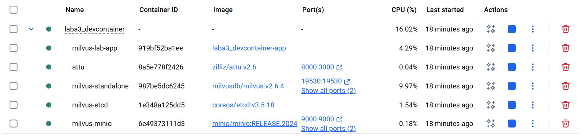

_Рисунок 1: Успешно запущенный devcontainer_

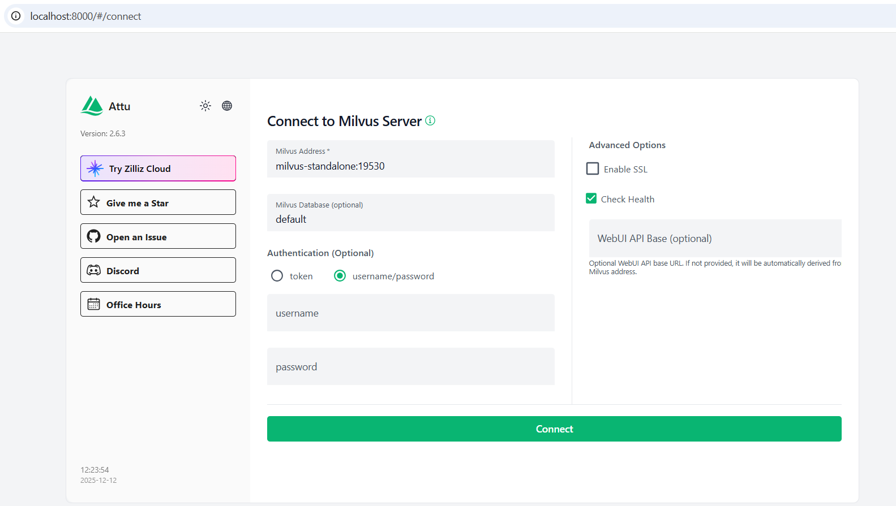

_Рисунок 2: Запущенный интерфейс Attu_

## _2. Создание векторной базы данных_

Во втором пункте добавляем файл milvus_client.py в котором создаём класс MilvusClient для работы с векторной базой данных Milvus. Здесь по инструкции мы реализуем: подключение к базе, создание коллекции в методе create_collection(), загрузка данных в методе insert_data() и выполнение семантического поиска в методе search().

## _3. Парсинг текстовых файлов_

Теперь переходим к парсингу данных. В начале был создан файл text_parser.py в котором прописываются методы для чтение файла, нормализации текста, разбиения его на чанки и сам полный парсинг файла с автоматическим чанкированием. Далее создаём файл document_processor.py в котором реализуем по инструкции класс DocumentProcessor для обработки файлов. Также после ознакомления с всем файлом были добавлены функции для обработки всех файлов в некоторой директории, их чанкирование, генерация embeddings и загрузка в милвус. В файле embedder.py реализуем генерацию векторных представлений текстов. Для этого используется модель multilingual-e5-base. Также после более подробного ознакомления с файлом, была добавлена функция create_embedding_function для использвоания embedder в ранее раелизованном классе DocumentProcessor.

Также был добавлен файл example_usage.py, который реализует сценарий полного использования системы: подключение к Milvus, создание коллекции, обработка текстовых файлов, генерация embeddings и выполнение семантического поиска. В файл milvus_client.py были добавлены дополнительные методы для получения информации о коллекции, удаление коллекции, извлечение всех чанков из конкретного документа, восстановление исходного текста докумената. Также была добавлена папка files для текстовых файлов.

После добавления всех нужных файлов, был запущен сценарий командой python example_usage.py (рис. 3, 4, 5, 6).

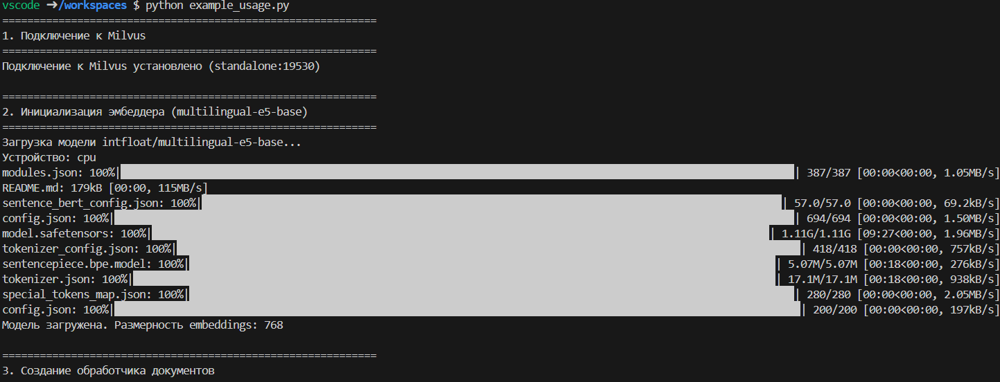

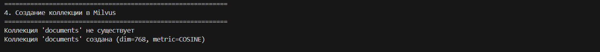


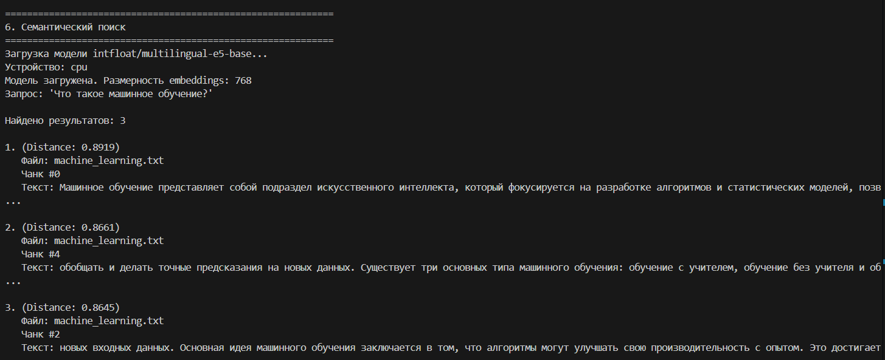

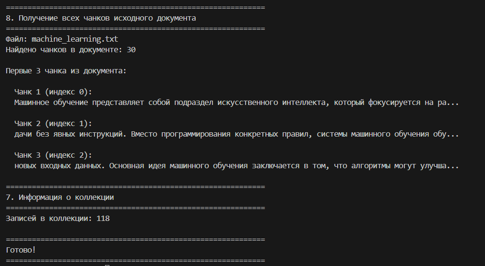

_Рисунок 3, 4, 5, 6, 7: Запуск файла example_usage.py_

## _4. Задания_

В первом задании нужно было запустить описанный выше сценарий с помощью gpu, модифицировав конфиг под использование cuda-зависимостей. Для этого в файл docker-compsoe.yml была добавлена строчка gpus: all благодаря которой теперь контейнер видит все доступные видеокарты хоста. Также в файле requirements.txt были добавлены CUDA-совместимые версии библиотек PyTorch, что позволяет выполнять вычисления нейронной сети на GPU вместо CPU. 
```python
pymilvus
sentence-transformers
numpy<2
pillow>=10.0.0
torch==2.2.1
torchvision==0.17.1
torchaudio==2.2.1
-f https://download.pytorch.org/whl/cu121
```

Ниже представлен процесс сборки контейнера, где видно как устанавливаются CUDA-версии библиотек PyTorch, чтобы использовать GPU для вычислений (рис. 8).

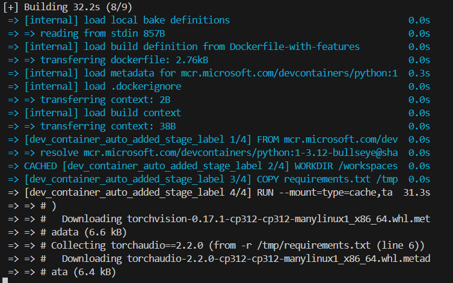

_Рисунок 8: Процесс сборки контейнера с загрузкой GPU-версий библиотек PyTorch._

На следующей картинке показан корректный запуск ранее реализованного сценария с помощью gpu (рис. 9, 10, 11, 12).

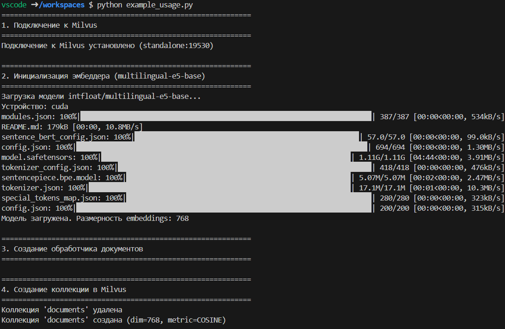

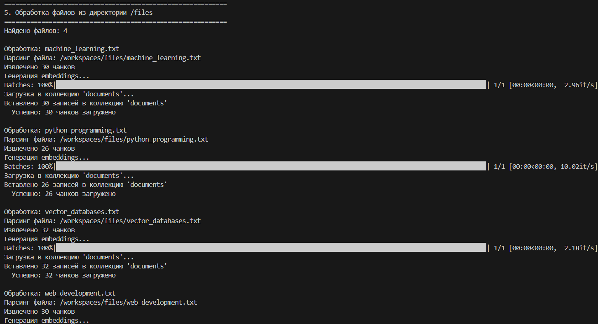

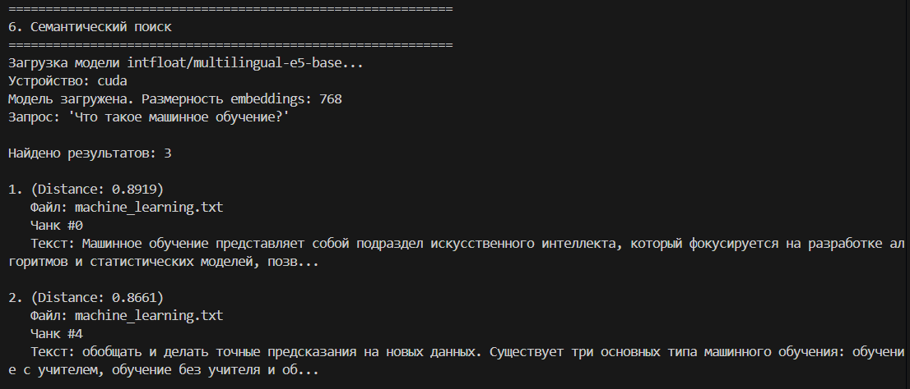

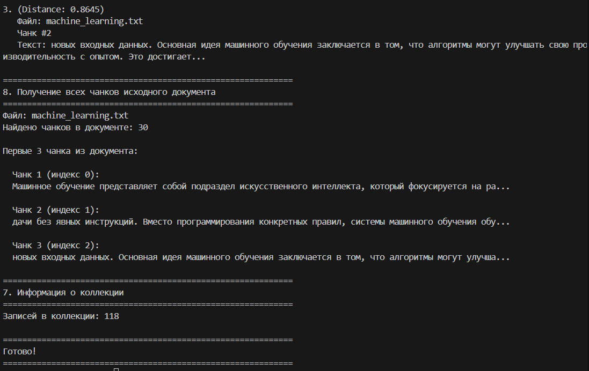

_Рисунок 9, 10, 11, 12: Запуск файла example_usage.py с помощью gpu_

Вторым заданием в данной лабораторной работе стало реализация полноценного API для работы с милвусом. Для этого устанавливаем django (рис. 13) и создаём новый проект с именем project.

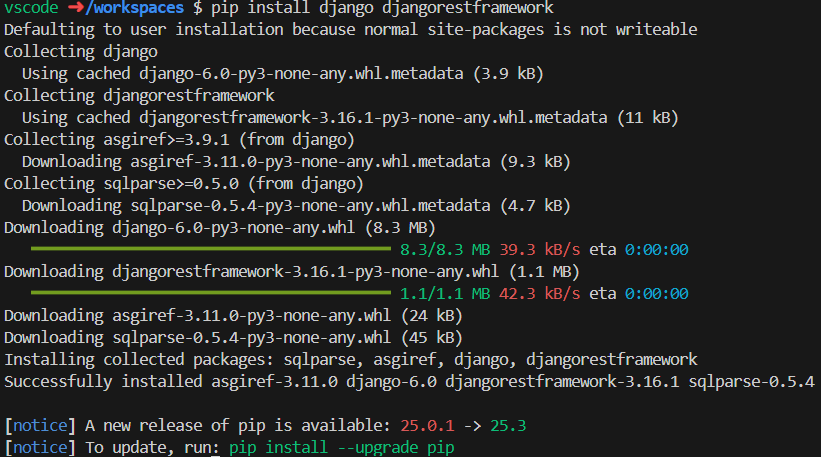

_Рисунок 13: Установка Django_

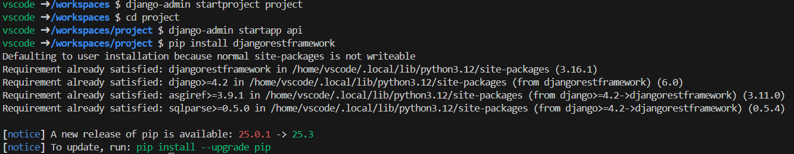

_Рисунок 14: Создание проекта Django_

После этого добавляем в INSTALLED_APPS в файле settings.py два приложения: rest_framework и api, чтобы подключить Django REST Framework и наше собственное приложение с эндпоинтами для работы с Milvus.

```python
INSTALLED_APPS = [
    ...
    'rest_framework',
    'api',
]
```

Добавляем все файлы, которые были реализованы ранее (кроме example_usage.py) в папку core, чтобы спокойно их импортировать, когда они будут нам нужны.

Теперь создаём файл services.py, который отвечает за инициализацию основных компонентов системы. Создаём milvus_client, который является экземпляром клиента Milvus. Он нужен для подключения к базе данных и выполнению операций с коллекциями, вставки и поиска векторов. Далее создаём embedder, который нужен для генерации embeddings текстов и запросов. Затем создаём функцию embedding_fn для использовать обработчик документов и добавляем document_processor, который объединяет возможности парсинга текстов, генерации embeddings и загрузки чанков в Milvus.

```python
from core.milvus_client import MilvusClient
from core.embedder import Embedder, create_embedding_function
from core.document_processor import DocumentProcessor

milvus_client = MilvusClient(host="standalone", port=19530)

embedder = Embedder(device="cuda")

embedding_fn = create_embedding_function(
    model_name="intfloat/multilingual-e5-base",
    batch_size=32
)

document_processor = DocumentProcessor(
    milvus_client=milvus_client,
    chunk_size=256,
    chunk_overlap=64,
    embedding_function=embedding_fn
)
```

Создаём файл serializers.py, который отвечает за валидацию и структурирование данных, поступающих через API. Так как в сценарии были создание коллекций, загрузку документов и семантический поиск, реализцем это с помощью сериализаторов CreateCollectionSerializer, UploadDocumentsSerializer и SearchSerializer.

CreateCollectionSerializer мы создаём для проверки данных, перед созданием коллекции в Milvus. Также как и в сценарии, добавляем force_delete для удаления существующей коллекции перед созданием новой.

```python
class CreateCollectionSerializer(serializers.Serializer):
    name = serializers.CharField()
    dimension = serializers.IntegerField(default=768)
    metric_type = serializers.ChoiceField(
        choices=["COSINE", "L2", "IP"],
        default="COSINE"
    )
    force_delete = serializers.BooleanField(
        default=False)
```

UploadDocumentsSerializer создаём для загрузки документов в коллекцию. Как и в сценарии, проверям указана ли директория с файлами или текст для загрузки, и передаём эти данные обработчику документов для чанкирования и генерации embeddings.

```python
class UploadDocumentsSerializer(serializers.Serializer):
    collection_name = serializers.CharField()
    directory = serializers.CharField(required=False)
    text = serializers.CharField(required=False)
```

SearchSerializer используется для семантического поиска. Он валидирует коллекцию для поиска, текст запроса и количество ближайших результатов.

```python
class SearchSerializer(serializers.Serializer):
    collection_name = serializers.CharField()
    query = serializers.CharField()
    top_k = serializers.IntegerField(default=3)
```

В файл views.py реализуем обработчики API-запросов, которые обеспечивают взаимодействие пользователя с системой через HTTP-запросы. Для этого были добавлены следующие классы CreateCollectionView, UploadDocumentsView, SemanticSearchView, DocumentChunksView, CollectionInfoView.

CreateCollectionView создаёт коллекции в Milvus через POST-запрос. В нём мы использем ранне созданный CreateCollectionSerializer для валидации входных данных.

```python
class CreateCollectionView(APIView):
    """Создание коллекции в Milvus"""

    def post(self, request):
        serializer = CreateCollectionSerializer(data=request.data)
        serializer.is_valid(raise_exception=True)
        data = serializer.validated_data

        if data.get("force_delete"):
            milvus_client.delete_collection(data["name"])

        collection = milvus_client.create_collection(
            collection_name=data["name"],
            dimension=data["dimension"],
            metric_type=data["metric_type"]
        )

        return Response(
            {"message": f"Коллекция '{collection.name}' создана"},
            status=status.HTTP_201_CREATED
        )
```

UploadDocumentsView обрабатывает POST-запросы для загрузки документов или текста в коллекцию, используя ранее созданный UploadDocumentsSerializer. Также здесь вызывается DocumentProcessor для чанкирования текста и генерации embeddings, после чего данные вставляются в коллекцию Milvus.

```python
class UploadDocumentsView(APIView):
    """Загрузка файлов или текста в Milvus"""

    def post(self, request):
        serializer = UploadDocumentsSerializer(data=request.data)
        serializer.is_valid(raise_exception=True)
        data = serializer.validated_data

        collection_name = data["collection_name"]
        directory = data.get("directory")

        import os

        if directory and os.path.exists(directory):
            txt_files = [
                f for f in os.listdir(directory)
                if f.endswith(".txt")
            ]

            results = []

            for txt_file in txt_files:
                file_path = os.path.join(directory, txt_file)

                result = document_processor.process_file(
                    file_path=file_path,
                    collection_name=collection_name
                )

                results.append({
                    "file": txt_file,
                    "success": result["success"],
                    "chunks_count": result.get("chunks_count", 0),
                    "error": result.get("error")
                })

            return Response({
                "directory": directory,
                "files_found": len(txt_files),
                "results": results
            })

        sample_text = data.get("text")
        if sample_text:
            result = document_processor.process_text(
                text=sample_text,
                collection_name=collection_name
            )
            return Response(result)

        return Response(
            {
                "error": "Директория не найдена и текст не передан"
            },
            status=status.HTTP_400_BAD_REQUEST
        )
```

В SemanticSearchView выполняются POST-запросы для семантического поиска по коллекции. Для этого используется также ранее созданый SearchSerializer. Генерирует embedding запроса с помощью embedder и вызывает метод поиска в Milvus.

```python
class SemanticSearchView(APIView):
    """Семантический поиск в Milvus"""

    def post(self, request):
        serializer = SearchSerializer(data=request.data)
        serializer.is_valid(raise_exception=True)
        data = serializer.validated_data

        query_vector = embedder.encode_query(data["query"])

        results = milvus_client.search(
            collection_name=data["collection_name"],
            query_vectors=[query_vector],
            top_k=data["top_k"]
        )

        return Response(results[0])
```

DocumentChunksView позволяет через GET запрос получить все чанки конкретного документа по его пути.

```python
class DocumentChunksView(APIView):
    """Получение всех чанков документа по пути"""

    def get(self, request, collection_name, file_path):
        try:
            chunks = milvus_client.get_document_chunks(
                collection_name, file_path)
            return Response(chunks)
        except Exception as e:
            return Response({"error": str(e)}, status=400)
```

CollectionInfoView позволяет через GET запрос вернуть информацию о коллекции: сколько записей, существование коллекции и другие метаданные. Так как данные из Milvus содержат сложные объекты, которые не могут быть автоматически преобразованы в JSON, создаём словари с простыми типами: строками, числами, списками и вложенными словарями. После преобразования всех компонентов в читаемый формат, данные возвращаются как JSON.

```python
class CollectionInfoView(APIView):
    """Информация о коллекции Milvus"""

    def get(self, request, name):
        try:
            info = milvus_client.get_collection_info(name)

            if not info['exists']:
                return Response({"error": f"Коллекция '{name}' не найдена"}, status=404)

            schema = info.get('schema')
            if schema:
                fields = []
                for field in getattr(schema, "fields", []):
                    fields.append({
                        "name": field.name,
                        "dtype": str(field.dtype),
                        "is_primary": getattr(field, "is_primary", False),
                        "auto_id": getattr(field, "auto_id", False),
                        "max_length": getattr(field, "max_length", None),
                        "description": getattr(field, "description", "")
                    })
                info['schema'] = {
                    "description": getattr(schema, "description", ""),
                    "fields": fields
                }

            indexes = info.get('indexes', [])
            serializable_indexes = []
            for index in indexes:
                serializable_indexes.append({
                    "field_name": getattr(index, "field_name", ""),
                    "index_type": getattr(index, "index_type", ""),
                    "params": getattr(index, "params", {})
                })
            info['indexes'] = serializable_indexes

            return Response(info)

        except Exception as e:
            return Response({"error": str(e)}, status=400)
```
Теперь в файле urls.py пропишем маршруты, которые HTTP-запросы пользователя с нужными API запросами. Добавляем путь collections/create/ для создания новой коллекции в Milvus, collections/<str:name>/info/ для получения информации о коллекции, documents/upload/ для загрузки текстовых файлов или произвольного текста в Milvus, documents/<str:collection_name>/chunks/<path:file_path>/ для получения всех чанков конкретного документа по его пути и добавляем search/ для выполнения семантического поиска по коллекции.

```python
from django.urls import path
from .views import (
    CreateCollectionView,
    UploadDocumentsView,
    SemanticSearchView,
    CollectionInfoView,
    DocumentChunksView
)

urlpatterns = [
    path("collections/create/", CreateCollectionView.as_view()),
    path("collections/<str:name>/info/", CollectionInfoView.as_view()),
    path("documents/upload/", UploadDocumentsView.as_view()),
    path("documents/<str:collection_name>/chunks/<path:file_path>/",
         DocumentChunksView.as_view()),
    path("search/", SemanticSearchView.as_view()),
]
```

Теперь запускаем сервер с помощью команды python manage.py runserver 0.0.0.0:8001 (рис. 15)

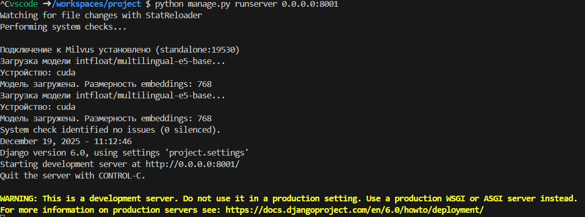

_Рисунок 15: Запуск сервера Django_

Проверяем все ранее созданные методы, аналогично с сценарием из файла example_usage:

POST http://localhost:8001/api/collections/create/ создаёт новую коллекцию в Milvus с заданным именем, размерностью векторов и типом метрики (рис. 16).

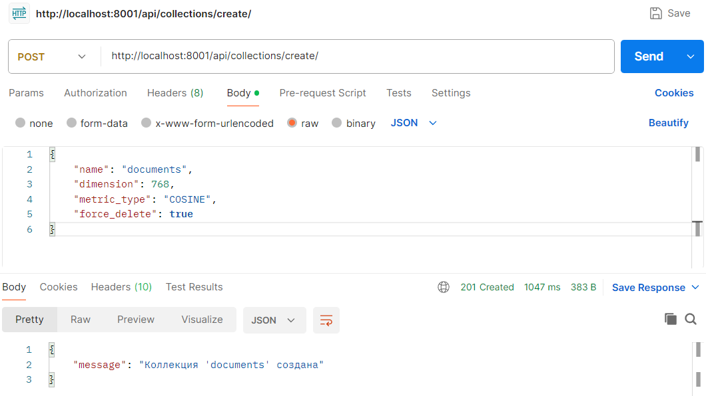

_Рисунок 16: Работа метода для создания коллекции_

POST http://localhost:8001/api/documents/upload/ загружает документы в коллекцию Milvus. Ниже представлен выриант с загрузкой через указа директории, но также есть возможность загрузить просто текст из запроса (рис. 17, 18).

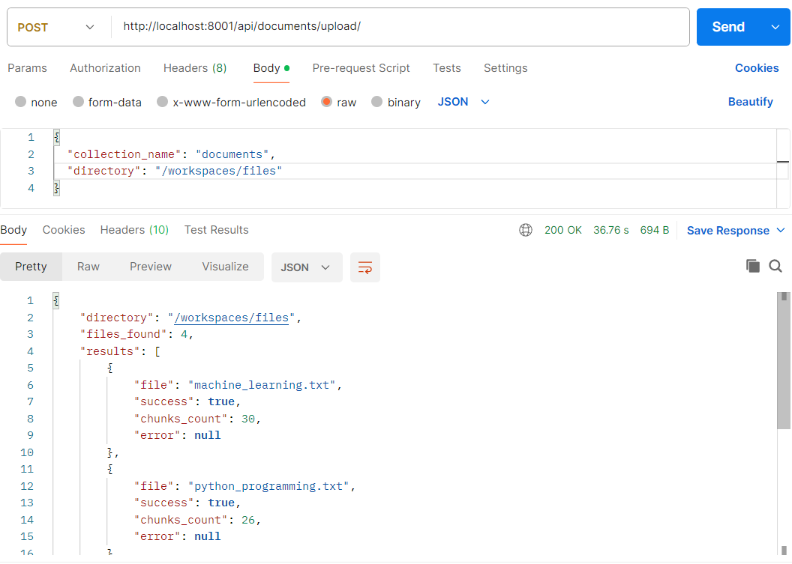

_Рисунок 17: Работа метода для загрузки документов_

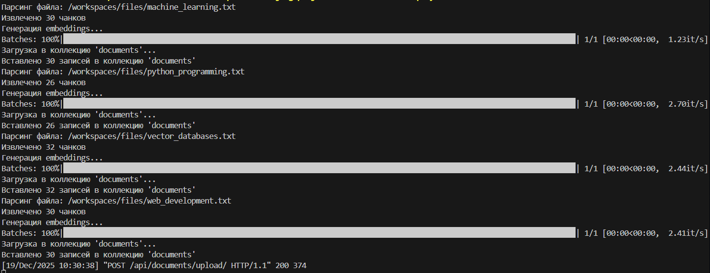

_Рисунок 18: Вывод в консоли информации о процессе загрузки текста из документов_

POST http://localhost:8001/api/search/ выполняет семантический поиск в указанной коллекции Milvus (рис. 19).

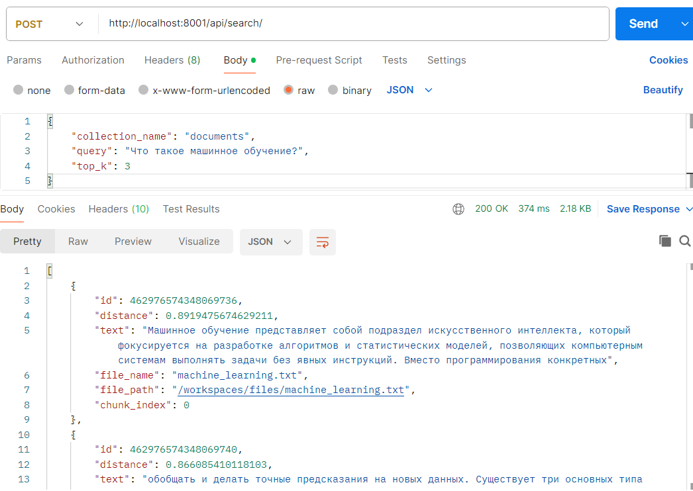

_Рисунок 19: Работа метода для поиска в коллекции documents_

GET http://localhost:8001/api/collections/<str:name>/info/ возвращает информацию об указанной коллекции Milvus (рис. 20).

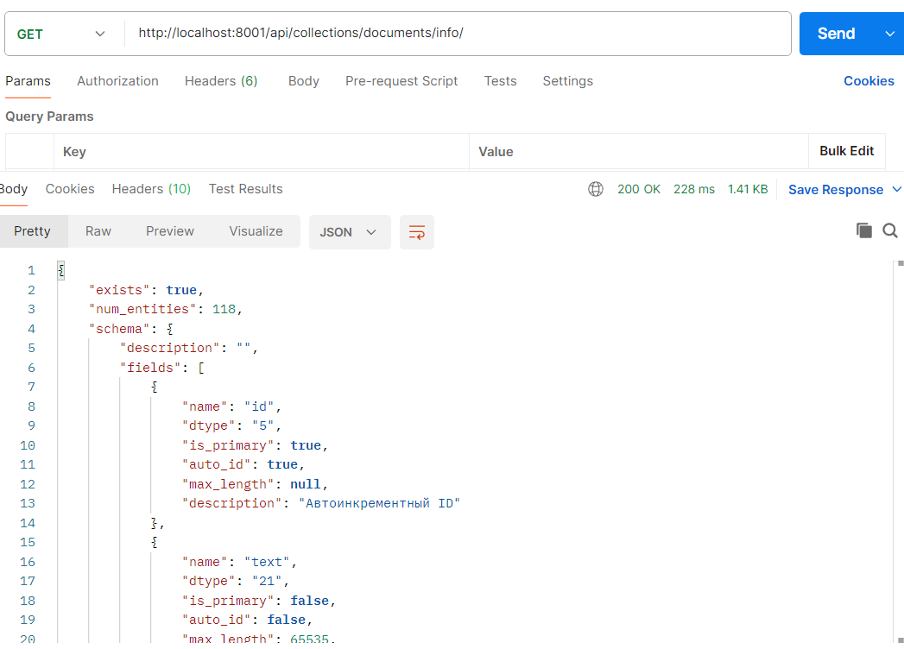

_Рисунок 20: Метод для передачи информации о коллекции documents_

GET http://localhost:8001/api/documents/<str:collection_name>/chunks/<path:file_path>/ возвращает все чанки из указанного документа в указанной коллекции.

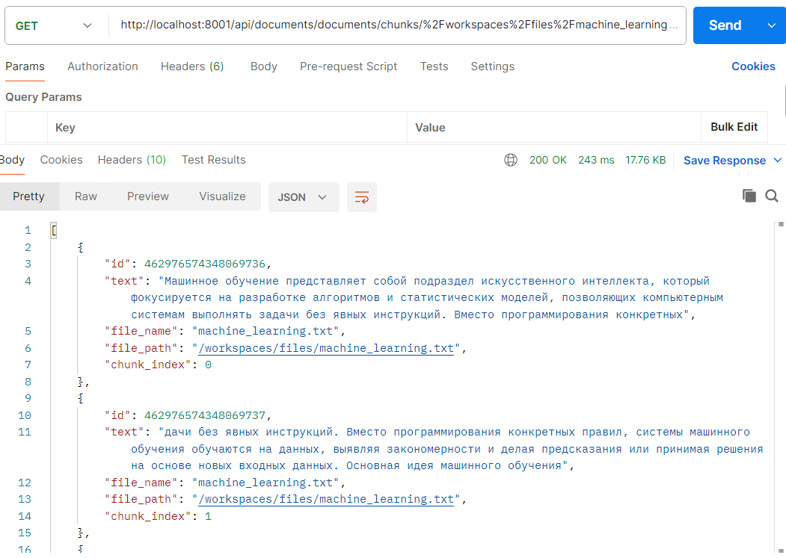

_Рисунок 21: Метод, который возвращает все чанки документа machine_learning.txt из коллекции documents_

Вывод: В ходе выполнения лабораторной работы был успешно реализован модуль для работы с векторной базой данных Milvus и создано полноценное API для загрузки текстовых данных, их обработки и семантического поиска. Были выполнены все задания лабораторной работы, а именно: настроено окружение с использованием Docker и devcontainer, реализован клиент Milvus для работы с коллекциями, добавлены функции парсинга текстовых файлов, чанкирования, генерации embeddings и загрузки данных в Milvus. Также был создан файл example_usage.py для демонстрации полного сценария работы с системой, включая создание коллекции, обработку документов и выполнение семантического поиска. После этого было выполнено задание по запуску сценария с помощью gpu, а также выполнение задания реализации полноценного API для работы с милвусом. Было создано три метода POST и два GET для реализации, подобно сценарию, работы с коллекциями и документами: создание коллекции, загрузка и обработка текстов, выполнение семантического поиска, получение информации о коллекции и извлечение всех чанков конкретного документа. Все функции API проверены и корректно работают через HTTP-запросы. Лабораторная работа позволила получить навыки работы с векторными базами данных, семантическим поиском, интеграцией Milvus с Django для обработки текстовой информации. Таким образом, цели работы были полностью достигнуты.